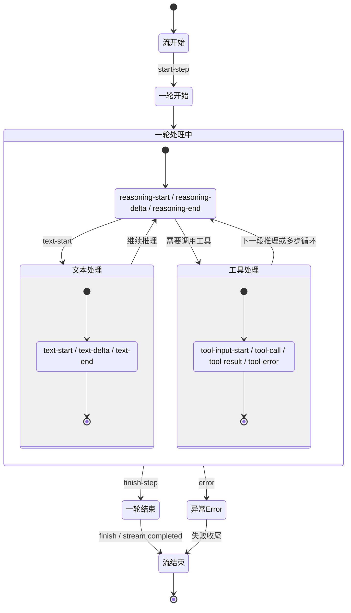

# ai包 stream event 分析

本文基于 `opencode` 的 `session/processor` 事件处理逻辑，从高层视角解释流式事件在一次 AI 处理过程中的职责分工。  
注意：这些阶段是“事件驱动的常见主路径”，不一定每次都严格线性、固定顺序执行。

## 流开始

- 对应事件：`start`
- 高层职责：
  - 将会话状态切到“处理中”。
  - 标记本次 assistant 输出流正式开始。
  - 为后续 step、文本、工具、reasoning 等事件建立上下文前提。

## 一轮开始

- 对应事件：`start-step`
- 高层职责：
  - 记录一次 agent step 的开始边界。
  - 产出可追踪的“阶段起点”信号，便于 UI 与日志对齐多步过程。
  - 作为后续本轮内文本、工具、reasoning 事件的语义锚点。

## AI想什么

对应 reasoning 生命周期事件：`reasoning-start`、`reasoning-delta`、`reasoning-end`。  
从高层上，它是“开始登记 -> 流式生长 -> 结束封存”的闭环。

### 1) `reasoning-start`：建立推理片段

- 职责定位：
  - 初始化一段新的 reasoning 片段。
  - 记录该片段的起始时刻与供应商元信息。
  - 防止同一片段被重复初始化（去重语义）。
- 设计意图：
  - 把“推理过程”从瞬时 token 流提升为可追踪实体。
  - 为后续增量拼接与最终封存准备容器。

### 2) `reasoning-delta`：推理内容流式增长

- 职责定位：
  - 接收并追加增量推理文本。
  - 同步推理过程中的元信息变化。
  - 通过事件把增量广播给实时消费方（如界面流式展示）。
- 设计意图：
  - 优先保证实时性与连续体验。
  - 让观察者能“边生成边看到”推理内容，而不是只看最终结果。

### 3) `reasoning-end`：推理片段收口定稿

- 职责定位：
  - 对推理文本做收尾整理（如尾部清理）。
  - 写入结束时刻，形成完整时间区间。
  - 更新最终元信息并将片段标记为已完成。
- 设计意图：
  - 把过程态转换为稳定态，形成可复查、可归档的最终版本。
  - 显式结束生命周期，避免后续误追加。

### 关于“reasoning 是否持久化”的高层结论

- 结构性持久化主要发生在片段的“建立”和“收尾”阶段。
- `reasoning-delta` 侧重实时增量分发与过程累积，不承担完整结构落盘语义。
- 因此系统采用的是“实时流靠事件、最终状态靠定稿更新”的策略。

## AI说什么

- 对应事件：`text-start`、`text-delta`、`text-end`
- 高层职责：
  - 创建本轮输出文本片段。
  - 持续接收并传播文本增量。
  - 在文本结束时触发补全后处理（如插件钩子）并写回最终文本。

## AI做什么

- 对应事件：`tool-input-start`、`tool-call`、`tool-result`、`tool-error`
- 高层职责：
  - 表达工具调用生命周期：准备输入 -> 发起调用 -> 得到结果/错误。
  - 将工具状态从 pending/running 推进到 completed/error。
  - 记录工具交互轨迹，支撑可观测性与回放。

## 异常Error

- 对应事件：`error`
- 高层职责：
  - 将模型流中的错误显式上抛到统一错误处理路径。
  - 中断当前正常事件流水并进入失败分支收尾。
  - 保证上层可感知失败原因，而不是静默吞错。

## 一轮结束

- 对应事件：`finish-step`
- 高层职责：
  - 记录本轮 step 的结束边界。
  - 汇总本轮成本与 token 使用信息。
  - 执行本轮收尾动作（如 patch/summary/是否触发压缩等策略判断）。

## 流结束

- 对应事件：`finish` + 流迭代自然结束
- 高层职责：
  - 标记整次流式交互完成并进入后续统一收尾。
  - 将会话从“处理中”恢复到稳定状态。
  - 为后续消息展示、审计、分享等链路提供完整结果。

## 总结

这套 stream event 机制本质是一个事件驱动状态机：  
它不强依赖固定顺序，而是按事件到达顺序持续更新“会话状态 + 消息片段 + 工具轨迹 + 推理轨迹”。  
其中 reasoning 的核心价值是把“AI想什么”从不可见过程，变成可实时观察、可最终归档的结构化生命周期数据。
