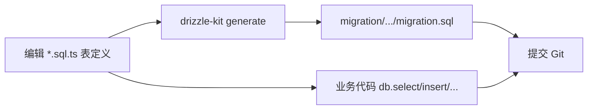
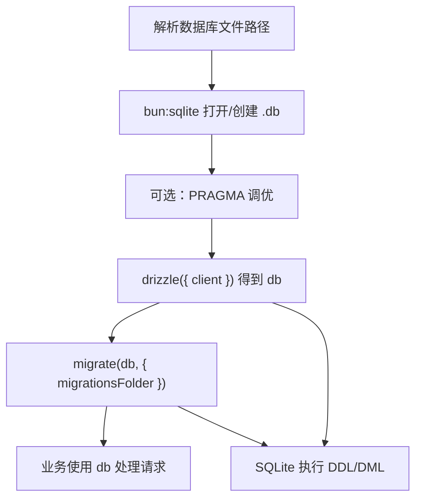

# 数据库开发流程（Drizzle + SQLite）

本文说明本仓库在 **Drizzle（ORM / 迁移编排）** 与 **SQLite（实际存储引擎与 `.db` 文件）** 分工下的**开发流程**与**应用启动流程**，以及各环节推荐方案。适用于无历史库债、从零演进 schema 的场景。

---

## 1. 分层与职责

| 层次 | 技术 | 职责 |
|------|------|------|
| ORM / 访问层 | `drizzle-orm`、`drizzle-orm/sqlite-core`、`drizzle-orm/bun-sqlite` | TypeScript 表定义、查询构造、事务 API；运行时把操作交给驱动 |
| 迁移执行 | `drizzle-orm/bun-sqlite/migrator` 的 `migrate` | 按顺序执行已生成且尚未应用的 `migration.sql` |
| 驱动 | `bun:sqlite`（Bun 内置） | 打开/创建 `.db`、执行 SQL、PRAGMA |
| 数据库引擎 | SQLite | 事务、锁、存储格式；数据落在磁盘文件 |
| 开发期工具 | `drizzle-kit`、`drizzle.config.ts` | 根据 schema 生成迁移目录与 SQL；一般不进入线上请求热路径 |

**结论**：Drizzle 管「怎么描述库、怎么查、怎么跑迁移脚本」；SQLite 管「数据真正存在哪、怎么执行 SQL」。

---

## 2. 持久层开发框架大纲（双线）

持久层日常开发可拆为 **两条线**，可并行迭代、职责清晰；整体仍落在「Drizzle + SQLite」这一套技术选型内。

| 线条 | 范围 | 典型产出 / 动作 |
|------|------|------------------|
| **线 1：结构演进** | 更新表结构 + migration | `*.sql.ts` 表定义；`drizzle-kit generate` 生成 `migration/`；应用启动时 `migrate` 将本地库结构对齐到当前版本 |
| **线 2：业务持久化逻辑** | 表怎么用、何时写读 | Repository / Service / 用例层中对 `db` 的查询、事务、与领域规则绑在一起的读写策略 |

**分工约定**：

- **线 1** 回答「库长什么样」：与具体业务规则弱相关，以可版本化的 DDL（迁移 SQL）为准。
- **线 2** 回答「在什么业务流程里如何读写这些数据」：**领域规则与复杂查询放在线 2**，避免在 `*.sql.ts` 中堆砌业务逻辑；表文件侧仅保留**结构定义**与必要的**列类型**（如 `json` 的 `$type`）。

两条线通过「线 1 先提供稳定的表与索引，线 2 在代码里消费这些表」衔接；若业务需要先加列再加逻辑，则先走线 1，再走线 2。

---

## 3. 开发流程（改结构 + 写业务）

### 3.1 流程概览

### 3.2 环节说明与方案选择

| 环节 | 做什么 | 推荐方案 | 说明 |
|------|--------|----------|------|
| 表结构定义 | 声明表、列、索引、外键 | `drizzle-orm/sqlite-core` 的 `sqliteTable` 等 | 列名、表名建议 **snake_case**；外键列命名 `<entity>_id` |
| 配置 Kit | 指定 dialect、schema 路径、输出目录 | 仓库根（或应用目录）`drizzle.config.ts` | `dialect: "sqlite"`；`schema` 指向所有 `*.sql.ts`；`out` 指向 `migration/` |
| 生成迁移 | 产出可版本化的 SQL | `bun run db:generate --name <slug>`（见 §8） | 每次结构性变更后生成；**人工审阅** 子目录内 `migration.sql` 再提交 |
| 版本管理 | 协作与回滚依据 | Git 管理 `migration/` 与各快照文件 | 迁移与代码同仓、同发布节奏 |
| 业务访问 | CRUD、事务 | `drizzle()` 得到的 `db` + `drizzle-orm` 导出算子（如 `eq`） | 复杂写操作使用 `db.transaction` |
| 静态检查 | 类型与 schema 一致 | `bun` / TypeScript 检查（如根目录 `typecheck` 脚本） | 避免仅运行时才发现列名错误 |

### 3.3 日常操作顺序（建议）

1. 修改或新增 `*.sql.ts`。
2. 在配置好 `drizzle.config.ts` 的前提下执行 **generate**，生成新的 `migration/<时间戳>_<名称>/`。
3. 阅读 `migration.sql`，确认与预期一致后提交。
4. 编写或调整使用 `db` 的业务代码。
5. 本地启动应用，确认 **启动时 migrate** 后行为正确。

---

## 4. 应用启动流程（运行时）

### 4.1 流程概览

### 4.2 环节说明与方案选择

| 顺序 | 步骤 | 推荐方案 | 说明 |
|------|------|----------|------|
| 1 | 数据库路径 | 环境变量或应用数据目录下的固定文件名（如 `app.db`） | 避免写死机器绝对路径进仓库 |
| 2 | 打开连接 | `new Database(path, { create: true })`（`bun:sqlite`） | 由 Bun 内置驱动管理连接 |
| 3 | 引擎参数 | `PRAGMA journal_mode=WAL`、`foreign_keys=ON`、`busy_timeout=...` 等按需设置 | 提升并发与数据完整性；与 opencode 等生产实践对齐时可参考同类组合 |
| 4 | ORM 客户端 | `drizzle({ client: sqlite })` | 后续统一通过 `db` 访问 |
| 5 | 结构对齐 | `migrate(db, { migrationsFolder })`（与 Drizzle 1.x 约定相同：扫描 `migration/<YYYYMMDDHHMMSS>_<slug>/migration.sql`，无 `meta/_journal.json`） | **只向前**应用未执行过的迁移；`packages/app/src/storage/db.ts` 在 `Database.Client()` 内执行 |
| 6 | 业务逻辑 | `select` / `insert` / `update` / `delete` / `transaction` | 不在此文档展开具体 API |

---

## 5. 与「旧持久化方案」的边界（本仓库方向）

本项目的选型是 **仅采用 Drizzle + SQLite 作为持久层**，不包含「JSON 文件仓 + 一次性导入 SQLite」等历史迁移链路。若未来需从外部导入数据，应单独设计 **ETL 或一次性脚本**，而非与日常 `migrate` 混为一谈。

---

## 6. 迁移回滚与生产预期（简要）

| 事项 | 说明 |
|------|------|
| `migrate` 的方向 | **仅向前**；用于把当前库结构更新到与代码中迁移集合一致 |
| 常见「回滚」 | **应用发布回退**较常见；数据库结构很少做「整版本 down」 |
| 撤销某次 schema 变更 | 通常再 **新增一条向前迁移** 抵消上次变更，或 **从备份恢复 `.db`** |
| 日常重心 | **维护好 forward migration**；重要环境保留 **`.db` 备份** |

---

## 7. 依赖清单

| 依赖 | 版本策略 | 用途 |
|------|----------|------|
| `drizzle-orm` | `1.0.0-beta.16-ea816b6`（catalog 锁定） | ORM、运行时访问、`migrate` |
| `drizzle-kit` | 同上 | `generate` 产出 **`migration/<tag>/{migration.sql,snapshot.json}`** |
| Bun 内置 `bun:sqlite` | 随 Bun | SQLite 驱动 |

---

## 8. 迁移目录布局与命令（`@gepick/app`）

与 **Drizzle Kit 1.x** 约定一致：**每个迁移一个子目录**，目录名为 **`YYYYMMDDHHMMSS_<slug>`**，内含 **`migration.sql`** 与 **`snapshot.json`**（由 `drizzle-kit generate` 生成；**无**旧版根目录 `meta/_journal.json`）。

- **生成**（在 `gepick` 仓库根）：  
  `bun run db:generate --name add_session_workspace_id`  
  Drizzle Kit 1.x 会自动带时间戳前缀；无需再传 `--prefix`。
- **运行时**：`migrate(db, { migrationsFolder: "packages/app/migration" })`（相对应用根目录解析），见 `packages/app/src/storage/db.ts`。

---

## 9. 文档维护

当 **`drizzle.config.ts`、依赖版本或脚本名** 变更时，同步更新第 7、8 节。
