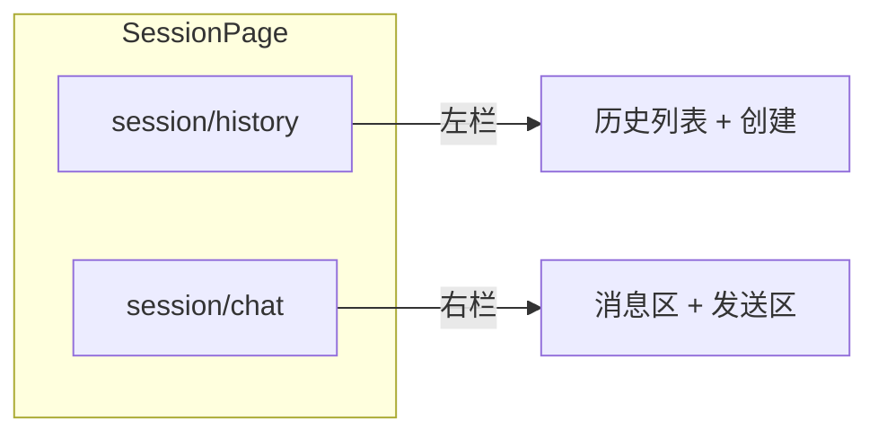

# 会话界面 v1

**状态**：v1 需求说明（布局与交互）  
**关联**：[与 opencode-app 配套对接说明](../与-opencode-app-配套对接说明.md)（数据流、API、Zustand 等）

---

## 1. 目的与范围

v1 描述**聊天主界面**的信息架构与基础交互：

- **左侧**：会话历史区（列表 + 当前高亮 + 新建会话）。
- **右侧**：Chat 主区，**上**为会话容器（按左右对话展示历史），**下**为发送区。

Store 字段名、HTTP/SSE 调用顺序在《配套对接》中约定；**源码目录**见下文「[设计代码目录](#5-设计代码目录)」。

---

## 2. 整体布局

- 视口内**左右分栏**：左栏固定为「会话历史」，右栏占剩余宽度为「Chat 主区」。
- 右栏在垂直方向分为**上下两层**：
  - **上层**：会话容器区（可滚动，占满除发送区外的剩余高度）。
  - **下层**：发送区（输入 + 发送控件，高度随设计可固定或最小高度）。
- 发送区域应该永远固定在Chat区域的最底部，处于视觉可见区域。只有Chat会话容器会滚动会话内容。

建议技术实现上用 **flex 列布局**：下层发送区 `flex-shrink: 0`，上层容器 `flex: 1`、`min-height: 0` 以便内部滚动不撑破页面。

---

## 3. 左侧：会话历史区域

### 3.1 展示内容

- 区域用于**展示会话历史列表**（多个会话 item 垂直排列，可滚动）。
- 每个会话 item **v1 仅展示「会话 title」**（与后端 `Session` 的标题字段一致，如 `title` / 展示名；具体字段名以实现为准）。

### 3.2 当前会话与点击行为

- **当前正在使用的会话**在列表中应**高亮**（背景/边框/文字色等任意一种可区分的视觉状态，实现时定）。
- 用户**点击某一会话 item** 时：
  - 将该会话视为**当前会话**（高亮随之移动）；
  - **右侧「会话容器区」**应**恢复并展示**该会话的**交互历史**（从服务端拉取或命中缓存，逻辑见《配套对接》）。

### 3.3 创建会话

- 提供**「创建会话」按钮**（文案可配置，如「新建会话」）。
- 用户点击后：
  - 调用后端**创建会话**能力（如 `POST /session`）；
  - 成功后，在**左侧会话历史列表**中**新增一条**会话 item（展示新会话的 title）；
  - 并将新会话切换为**当前会话**（高亮），右侧容器展示该新会话（初始可为空消息列表）。

若后续需「列表与后端全量同步」，见《配套对接》中关于**多会话列表接口**的约定；v1 以实现**创建后可见 + 切换**为最低目标。

---

## 4. 右侧：Chat 主区

### 4.1 上层：会话容器区

- 用于展示**当前会话**下的**完整交互历史**（与左侧选中的会话一致）。
- **布局**：**左右对话式**排列——
  - 用户侧消息与助手侧（及系统/tool 等）在视觉上区分左右或对齐方式（如用户偏右、助手偏左，或按产品统一一左一右**对话流**），v1 只要求**成对的对话布局**，具体 Tailwind/组件细稿可在实现时统一。

内容类型（文本、工具调用等）的展示规则仍以《配套对接》与 `SessionMessage` / Part 类型为准；v1 只约定**区域职责**为「按对话形式展示时间线上的消息」。

### 4.2 下层：发送区

- 与线框一致：**输入区域** + **发送入口**（按钮或带图标的「发送」控件）。
- 用户在本区输入并发送的内容，应进入**当前高亮会话**的交互历史，并触发与现网一致的发送 / SSE 流式行为（见《配套对接》）。

实现补充：**Enter 换行**；**Ctrl+Enter / ⌘+Enter** 或点击发送按钮发送。

---

## 5. 设计代码目录

会话界面相关实现放在 **`opencode-client` 的 `src/session/`** 下，与产品划分一致：**`history`** 对应左侧历史区、**`chat`** 对应右侧 Chat 主区。入口页面由 `SessionPage` 组合左右两栏（见树状结构中的 `SessionPage.tsx`）。

**约定路径**（本仓库，绝对路径以你的 clone 根为准）：

```text
apps/opencode-client/src/
  session/
    SessionPage.tsx          # 会话壳：整页左右分栏，装配 history + chat
    index.ts                 # 对外暴露 SessionPage（等）
    history/                 # 左侧「会话历史」子域
      SessionHistoryPanel.tsx
      index.ts
    chat/                    # 右侧「Chat 主区」子域
      SessionChatPanel.tsx
      index.ts
```

| 目录 / 文件 | 职责（与上文章节对应） |
|-------------|------------------------|
| `session/SessionPage.tsx` | 全页布局：左 `history`、右 `chat`，`min-w-0` / `min-h-0` 等由实现保证不撑破滚动。 |
| `session/history/*` | 会话列表（仅 **title**）、**当前高亮**、**创建会话** 按钮、点击项切换「当前会话」。 |
| `session/chat/*` | **上**：按**左右对话**展示当前会话消息流；**下**：输入与发送。 |

随功能细化，可在 **`history/`** 内增加如 `SessionListItem.tsx`、在 **`chat/`** 内增加如 `MessageTranscript.tsx` / `MessageComposer.tsx` 等，**不**再新建与 `history`、`chat` 同级的第三块「会话子域」目录，除非产品拆出新区域。

**导入别名**：工程已配置 `@/*` → `src/*`，推荐 `import { SessionPage } from "@/session/session-page"` 等，避免深层相对路径。



---

## 6. 与数据 / 后端的边界（摘要）

- **会话与消息的权威数据**在服务端；前端通过 HTTP + SSE 与 [`opencode-app`](../与-opencode-app-配套对接说明.md) 协同。
- **当前 `sessionId`** 与列表中「当前项」应保持一致；`localStorage` 仅存会话引用时，与《配套对接》中的键名与恢复策略一致。

---

## 7. v1 明确不展开的内容

- 细粒度设计规范（色板、圆角、动效、暗色模式）。
- Markdown/代码块/Tool 各类型子组件的逐条规范（在消息容器内分类型实现即可）。
- 多会话**全量列表**与后端列表接口的完整方案（随《配套对接》迭代）。

---

## 8. 修订记录

| 日期 | 说明 |
|------|------|
| 2026-04-22 | 首版：左栏会话历史（title、高亮、点击恢复、创建会话）；右栏上为左右对话式会话容器、下为发送区。 |
| 2026-04-22 | 新增「[设计代码目录](#5-设计代码目录)」：源码置于 `src/session/`，`session/history` 与 `session/chat` 划分；`SessionPage` 装配。需求本文：`apps/opencode-client/docs/会话界面/v1.md`。 |
