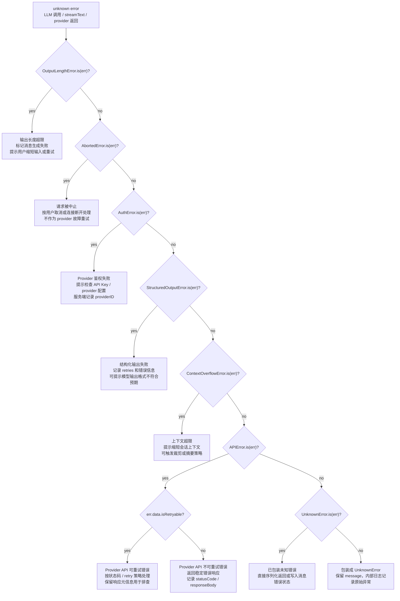

# LLMError 分支处理图（v1）

`LLMError` 是 Agent 模块对 LLM 调用异常的业务错误集合。入口拿到 `unknown` 错误后，先按各具体 `NamedError` 的 `is()` 方法做类型收窄；能识别的错误进入对应业务分支，不能识别的错误统一包装成 `UnknownError`。

## 分支约定

- `OutputLengthError`：模型输出达到长度限制，属于生成结果不可完整产出的业务失败。
- `AbortedError`：请求被主动中止，通常来自用户取消、连接断开或 `AbortSignal`。
- `AuthError`：provider 鉴权或配置问题，应该优先提示配置修复，而不是普通重试。
- `StructuredOutputError`：模型返回无法通过结构化解析，`retries` 用于判断是否已经耗尽修复机会。
- `ContextOverflowError`：上下文过长，适合触发裁剪、摘要或提示用户减少上下文。
- `APIError`：provider HTTP/API 层错误，`isRetryable` 决定是否进入重试分支。
- `UnknownError`：兜底错误，避免把非标准异常直接泄露到跨边界协议。
