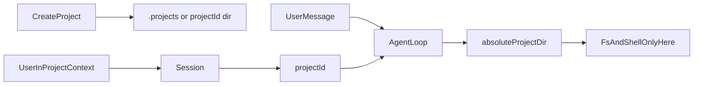

# Code 业务区 v2（本地 `.projects` 先行）

**状态**：v2 需求说明（后端主导闭环）  
**关联**：`packages/client/docs/design/code/v1.md`（v1 前端可运行闭环）  
**定位**：在 v1 的「单条 HTML 渲染」基础上，升级为 Agent **在磁盘上持续维护每个 project 的代码目录**；v2 首版 **不使用 git**；本地 git / GitHub 均为后续增强。

---

## 1. 设计目标

v2 目标：**为本仓库（gepick）内每个 project 分配固定磁盘目录**，由后端 Agent 在该目录内生成、修改与验证代码，并与 `project + session` 业务流程挂钩。

优先采用 **本地磁盘根目录**：`<monorepo-root>/.projects/`（对本仓库而言即 `gepick/.projects`），其下每个 project 对应 **`{projectId}` 子目录**，路径稳定、无需先接 GitHub 即可开发与验收。

可选后续：**本地 git**（目录内 `git init`/commit）与 **远端 GitHub**，见第 8 节「后续增强」。

---

## 2. 技术选型（v2 首版）

- **存储位置**：monorepo 根目录下的 **`.projects/`**（建议通过环境变量 `GEPICK_PROJECTS_ROOT` 覆盖绝对路径；未设置时解析为进程工作目录所属的仓库根下的 `.projects`，实现细节由实现约定）。
- **目录结构**：`.projects/{projectId}/` 为该 project **唯一允许的代码根**（Agent 工具白名单）。
- **版本控制**：v2 首版 **不使用 git**（不在 `.projects/{projectId}` 内 `git init`，不在工具层暴露 `git`）；仅以文件系统为权威状态。
- **远端**：v2 首版 **不接 GitHub**，也不 clone/push。
- **执行方式**：复用现有 `agent loop + tool calling`，新增「受限文件系统 + 受限命令执行」（无 git 子命令依赖）。
- **结果反馈**：通过现有消息/SSE 链路回传摘要（变更文件列表、命令退出码等）。

---

## 3. 架构与数据流

### 3.0 端到端概要（心智模型）

1. **用户创建 Project**：后端生成并持久化 `projectId`，同时在磁盘创建 **`<projectsRoot>/<projectId>/`**（含占位文件）。
2. **用户在某个 Project 下会话**：当前会话绑定到该 `projectId`（沿用现有「Project → Session」归属关系）。
3. **用户发送需求**：触发 Agent；后端根据 **当前会话所属的 `projectId`** 计算出 **唯一的 `absoluteProjectDir`**，Agent **只向该目录内** 写入或执行命令——**不靠模型猜路径**，也不信任用户文本里的路径当作落盘根目录。



### 3.1 角色边界

- `client/session`：会话与展示；不直接操作磁盘。
- `app/project`：创建 project 时在 **`.projects/{projectId}`** 创建目录与最小占位文件；可选更新初始化状态字段。
- `app/agent`：仅在对应子目录内读写与执行命令。
- `workspace runtime`：解析 `GEPICK_PROJECTS_ROOT` / 默认 `.projects` 根路径；按 `projectId` 互斥。

### 3.2 数据流

**阶段 A：创建 Project**

1. 用户创建 Project，后端持久化 `project_id`（及展示名等现有字段）。
2. 解析磁盘路径：`absoluteProjectDir = join(projectsRoot, projectId)`，其中 `projectsRoot` 默认为 `<monorepo-root>/.projects`。
3. 创建目录（若不存在）：`mkdir -p`；写入最小占位（如 `README.md` 含 `projectId`）。**不执行 `git init`。**
4. 可选 DB 字段：`code_init_status`：`pending | ready | failed`。

**阶段 B：会话内迭代**

1. 用户消息触发 `agent loop`。
2. Agent 工具层将 **`absoluteProjectDir` 为根路径** 注入上下文；仅允许该路径前缀下的读写与 `cwd`。
3. Agent 修改文件、运行约定验证命令（如后续接入 `pnpm test` 等）。
4. 不写 git 历史；里程碑若需要可由后续版本引入（见第 8 节）。

### 3.3 会话、`projectId` 与磁盘目录的绑定

| 概念 | 说明 |
|------|------|
| **Project** | 业务实体，主键 **`projectId`**（与磁盘子目录名一致）。 |
| **Session** | 归属于某一 Project（例如 `session.projectId` → `project.id`，具体字段以实现为准）。 |
| **`projectsRoot`** | 全局根路径：默认 `<monorepo-root>/.projects`，或由 **`GEPICK_PROJECTS_ROOT`** 指定绝对路径。 |
| **`absoluteProjectDir`** | **`path.join(projectsRoot, projectId)`** 经 **`path.resolve`** 规范化后的目录；Agent 仅能在此目录树下操作。 |

**硬性规则**

- Agent **不得**根据 assistant 输出的「建议路径」「相对路径字符串」私自切换落盘根目录；落盘根目录 **仅由服务端**根据当前会话解析出的 **`projectId`** 决定。
- 若会话无法解析 `projectId`（异常数据），应 **拒绝写文件** 并返回明确错误，而不是默认写到某处。

### 3.4 路径解析算法（实现必须一致）

输入：`projectId`（非空字符串）、可选环境变量 `GEPICK_PROJECTS_ROOT`。

1. **`projectsRoot`**  
   - 若设置了 `GEPICK_PROJECTS_ROOT`：取其值，`path.resolve` 为绝对路径。  
   - 否则：解析「monorepo 根目录」（与实现约定一致，例如自 `process.cwd()` 或 `import.meta` 向上寻址），再 `path.join(monorepoRoot, '.projects')`，最后 `path.resolve`。

2. **`absoluteProjectDir`**  
   - `path.resolve(projectsRoot, projectId)`。  
   - 建议校验 `projectId` 仅含安全字符（如禁止 `..`、`/`、空字符串），防止路径穿越。

3. **任意待写入/读取的相对路径 `rel`**（若工具接受相对路径）  
   - `target = path.resolve(absoluteProjectDir, rel)`。  
   - **必须**满足：`target === absoluteProjectDir || target.startsWith(absoluteProjectDir + path.sep)`（在规范化之后比较）。不满足则拒绝。

4. **`shell_run` 的 `cwd`**  
   - 必须为 `absoluteProjectDir`，或对允许的子路径同样做步骤 3 的前缀校验。

---

## 4. v2 实现范围

### 4.1 项目与路径（后端，v2 最简）

- **磁盘路径**：默认 **不落库路径字符串**，运行时 **`join(.projectsRoot, projectId)`**；若需人工覆盖单 project 目录，可在后续增加可选列 `project_path_override`。
- **`.projectsRoot` 解析**：默认 `<monorepo-root>/.projects`；可通过 `GEPICK_PROJECTS_ROOT` 指向自定义绝对路径（部署到非 git 工作树时使用）。

可选 DB 字段：

- `code_init_status`（磁盘目录是否就绪）。

路径约定：

- 目录名 **`{projectId}`**，与表格主键一致，避免展示名改名导致路径迁移。
- 展示名可与目录名解耦。

### 4.2 Agent 工具能力（后端）

最小集合（建议）：

- `project_resolve_dir`：根据 `projectId` 返回绝对路径（内部使用）。
- `fs_read` / `fs_write`：`absoluteProjectDir` 前缀校验。
- `shell_run`：`cwd` 限制在 `absoluteProjectDir`（实现时可禁止调用名称为 `git` 的命令，避免隐式引入版本控制）。

暂不包含：任何 **git** 操作、`repo_sync`、GitHub **push**（归入第 8 节）。

### 4.2.1 Agent 运行上下文注入（建议）

在进入本轮 `agent loop` 或组装 tool 上下文时，后端应注入（system 或等价契约）：

- **`projectId`**（当前会话所属）；
- **`absoluteProjectDir`**（服务端计算结果，字符串）；
- **`projectsRoot`**（可选，便于排查）。

Prompt 约束建议写明：**所有文件工具默认相对于 `absoluteProjectDir`；禁止写到该目录之外。**

### 4.3 执行与安全约束

- 路径守卫：所有路径 **resolve + normalize** 后必须以 `absoluteProjectDir + sep` 为前缀。
- 互斥：同一 `projectId` 写操作串行。
- **勿将 `.projects/` 提交进主仓库**：根目录 `.gitignore` 增加 `.projects/`（实现时检查）。

### 4.4 目录建议（后端）

```text
packages/app/src/
  server/
    project/
      service.ts                         # createProject：创建 .projects/{id} 与占位
      projects-root.ts                   # 解析 GEPICK_PROJECTS_ROOT / 默认 .projects
  agent/
    prompt.ts                            # v2：仅能在 project 目录内操作
    tools/
      project-fs.ts                      # 受限读写
      project-shell.ts                   # 受限命令
```

---

## 5. 非目标（v2 首版）

- **本地或远端 git**（无 `.git`、无 commit 语义；见第 8 节）。
- 对接 GitHub API / `gh` 创建远端目录或 push（见第 8 节）。
- PR 审批流、多仓库编排。
- 在线 IDE、多人实时协作编辑。
- 跨 project 原子事务（单 project 目录内一致即可）。

---

## 6. 验收标准（DoD）

- 创建 Project 后，磁盘上存在 **`<projectsRoot>/{projectId}`** 且含可读占位；**不创建** `.git` 目录。
- 用户在「Project A」下发出的需求，**只会**写入 **Project A** 对应的 **`absoluteProjectDir`**，不会串写到其他 `projectId` 目录。
- Agent 仅能在该目录内读写；越界被拒绝。
- 会话内多轮迭代后，变更可持续落在同一目录（刷新或重启进程后仍存在）。
- `.projects/` 不被误提交入主仓库（`.gitignore`）。
- 不影响现有 session 消息流与 SSE。

---

## 7. 修订记录

| 日期 | 说明 |
|------|------|
| 2026-04-28 | 初稿：GitHub monorepo / 直推 main 等方案（已演进，见下行）。 |
| 2026-04-28 | **定稿方向**：v2 首版以仓库根 `.projects/{projectId}` 为本地权威工作区；GitHub 同步列为第 8 节可选增强。 |
| 2026-04-28 | v2 首版明确 **不上 git**（无本地仓库、无 git 工具）；git 与 GitHub 均列入第 8 节后续。 |
| 2026-04-28 | 完善：端到端心智模型（创建 Project → `.projects/{projectId}` → 会话绑定 → Agent 仅写入解析路径）、会话与路径绑定表、`projectId`→磁盘路径算法、Agent 上下文注入与 DoD 防串项目。 |

---

## 8. 后续增强（可选，非 v2 首版 DoD）

**本地 git（建议先于远端）**

- 在 `.projects/{projectId}` 内 `git init`、里程碑 commit；工具层增加受控 `git_*`（仍限制路径与白名单命令）。

**GitHub**

- **sync/push**：将 `.projects/{projectId}` 与远端 monorepo 子目录对齐；
- 或创建 project 时异步远端初始化与 push。

---

*说明：文中 `<monorepo-root>` 对本仓库即包含 `packages/` 的 gepick 仓库根；默认磁盘目录写作 **`gepick/.projects`** 与「根目录 `.projects`」等价。*
