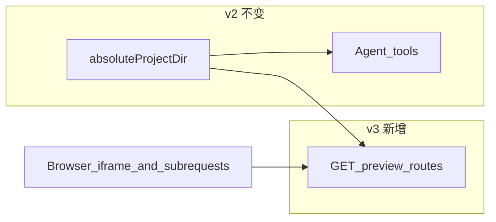

# Code 业务区 v3（工作区预览网关）

**状态**：v3 需求说明（后端：只读预览面）  
**关联**：

- 工作区与 Agent 权威规范仍由 [Code 业务区 v2](./v2.md) 定义（磁盘根、路径算法、工具约束 **以 v2 为准**）。
- 客户端消费方式：[Code 业务区 v3（client）](../../../../client/docs/design/code/v3.md)。

**定位**：在 v2 已落地的 **`absoluteProjectDir` + 单文件只读 API** 之上，增加 **同源、多资源的受控预览 HTTP 面**：按 URL 路径将请求映射到工作区内文件并返回正确 **Content-Type**，使浏览器能以 **文档 URL** 加载 `index.html` 及其相对路径引用的 CSS/JS/静态资源；**不改变**工作区目录结构、不引入第二套根路径、不替代 Agent 写入语义。

---

## 1. 设计目标

1. **与 v2 共用同一磁盘真相**：预览所服务文件必须来自 **v2 §3.4** 所约束的 **`path.resolve(absoluteProjectDir, rel)`** 结果；仅只读。
2. **支持多文件静态站点形态**：`index.html` 通过相对 URL 引用同项目下其他文件时，浏览器可依次请求并由本网关安全返回（与「整段 HTML 塞进 `srcDoc`」互补）。
3. **鉴权与归属一致**：访问预览资源的用户身份、**`projectId` 归属校验**与现有 Project/Session API 对齐；禁止仅凭猜测 `projectId` 读取他人工作区。
4. **行为可预测**：404/403/400 语义明确；目录列表是否开放由实现显式约定（默认建议 **禁止**目录浏览）。

---

## 2. 技术选型（v3 首版）

- **与 v2 单文件读取 API 的关系**：保留（或并存）现有 **按相对路径读取单文件正文** 的接口，供 client 降级、`curl`、非浏览器消费；预览网关面向 **浏览器导航与子资源链式加载**，路径守卫 **复用同一套** `resolve + 前缀校验` 实现或抽公共函数。
- **路由形态（约定，可实现时调整）**：在单一受保护前缀下暴露工作区静态树，例如：  
  `GET /projects/{projectId}/preview/{*path}`  
  其中 `path` 为相对于 **项目根** 的资源路径（见 §3.4）；`path` 缺省或指向目录时，行为见 **§2.1 默认入口**。
- **Content-Type**：按扩展名映射（`.html` → `text/html`，`.css` → `text/css`，`.js` → `text/javascript` 或 `application/javascript`，等）；未知扩展名可采用 `application/octet-stream` 或保守 `text/plain`（实现时选一种并文档化）。
- **缓存**：首版可对预览响应使用较短 `Cache-Control`（如 `private, no-store`）或配合 client 在 URL 上加版本/query  busting；强缓存策略列为 **§8** 可选增强。
- **git / GitHub**：与 v2 一致，**不在 v3 首版引入**。

### 2.1 默认入口（目录 URL）

- 当请求解析到 **目录** 或 `path` 为空时：尝试返回该目录下 **`index.html`**（若存在）；否则 **404**（不建议返回目录列表 HTML）。

---

## 3. 架构与数据流

### 3.0 端到端概要（心智模型）

v2 已保证 Agent 只在 **`absoluteProjectDir`** 内写入。v3 在 **同一目录**上增加 **HTTP GET 只读视图**：用户 iframe 的 `src` 指向预览基址后，浏览器对 `./style.css`、`./app.js` 的请求仍落在 **同一 `projectId` 前缀**下，由网关逐次解析为工作区内合法文件。



### 3.1 角色边界

- **`app/project` / workspace 解析**：继续由 v2 模块提供 **`absoluteProjectDir`**；v3 **不**复制第二套 projectsRoot 逻辑。
- **预览网关 handler**：仅 **GET**、只读文件；不做写、不执行 shell。
- **`client/session/code`**：将 iframe `src` 设为受控预览基址（详见 client v3）；不直接拼磁盘路径。

### 3.2 数据流（单次请求）

1. 校验鉴权与 **当前用户是否有权访问该 `projectId`**（与现有 project 读取规则一致）。
2. 解析 `projectId` → **`absoluteProjectDir`**（与 v2 相同算法）。
3. 将 URL 中的 `path` 段规范化为相对路径 **`rel`**（解码、规范化、禁止 `..` 段未转义穿越）。
4. **`target = path.resolve(absoluteProjectDir, rel)`**，并执行与 v2 **§3.4 步骤 3** 相同的前缀校验；失败则 **400/403**。
5. 若 `target` 为文件：读盘、设 `Content-Type`、返回 body。
6. 若 `target` 为目录：按 **§2.1** 尝试 `index.html`。
7. 不存在或越界：**404**。

### 3.3 与 v2 概念的对应关系

| 概念 | v3 中的角色 |
|------|-------------|
| **`projectId`** | URL 路径段；与 Session 绑定方式同 v2。 |
| **`absoluteProjectDir`** | 预览路径解析的根，与 v2 **完全一致**。 |
| **URL 路径 `→` `rel`** | 唯一新增：在 v2 的 `rel` 之上增加「从 HTTP 路径段到规范化 `rel`」的步骤（不得绕开前缀校验）。 |

### 3.4 预览 URL 路径 → 相对路径 `rel`（实现必须一致）

在 v2 **§3.4** 输入 **`rel`** 之前增加：

1. 从路由捕获 `path`（含多段），得到 **无前导 `/` 的字符串**（或显式剥离预览前缀后的剩余段）。
2. `rel = path.normalize(path.join(...segments))`，并拒绝包含 **`..`** 作为一段的路径（或使用与 fs 工具相同的规范化后再交 v2 校验）。
3. 将得到的 **`rel`** 代入 v2 **§3.4 步骤 3**。

---

## 4. v3 实现范围

### 4.1 OpenAPI / 路由契约

- 定义预览 **路径模板**、路径参数、`404/403` 语义；与现有 **`GET .../workspace/file`** 并存时，在文档中说明各自适用场景（浏览器链式加载 vs 单次读正文）。

### 4.2 实现复用

- **路径守卫**：与 `project-fs` / workspace read **共用** `resolveAbsoluteProjectDir` + `safeJoin`（或等价）逻辑，避免两份不一致。

### 4.3 安全与响应头

- **禁止路径穿越**（与 v2 等价强度）。
- **可选**：`Content-Security-Policy`、`X-Content-Type-Options` 由部署需求决定；首版可在 client iframe `sandbox` 侧优先约束脚本能力。
- **Range**：首版可不支持；大文件策略列 **§8**。

### 4.4 目录建议（后端）

```text
packages/app/src/server/project/
  controller.ts                    # 注册 preview 路由（或独立 preview-controller）
  service.ts                       # 复用 resolve + 读文件 + MIME
  projects-root.ts                 # 无变更：仍供 absoluteProjectDir
```

---

## 5. 非目标（v3 首版）

- 作为 **公网静态托管/CDN** 替代品（无 SLA、非匿名公开站）。
- **服务端渲染**、**反向代理到用户任意 URL**。
- **WebSocket** 热重载预览（可后续再接）。
- 在 v3 中引入 **git**、**GitHub push**（仍归 v2 §8 / 后续路线图）。

---

## 6. 验收标准（DoD）

- 同一 `projectId` 下，`index.html` 引用相对路径的 CSS/JS，在 iframe `src` 指向预览基址后 **可加载**（在无额外跨域阻断的前提下）。
- 恶意或错误路径（含 `..`、越界前缀）被拒绝，**不泄露**其他 project 文件。
- 无权用户访问他人 `projectId` 预览路径时 **403/404**（与产品一致，不得静默成功）。
- 不改变 v2 DoD：Agent 写入边界、`.gitignore`、会话消息与 SSE **不受影响**。

---

## 7. 修订记录

| 日期 | 说明 |
|------|------|
| 2026-04-28 | 初稿：v3 预览网关定位、路由与路径映射、与 v2 关系、DoD 与非目标。 |

---

## 8. 后续增强（可选，非 v3 首版 DoD）

- **Signed / 短时 token URL**：便于分享预览而不暴露长期 API cookie 语义（需单独威胁建模）。
- **`Cache-Control` / ETag**：减少重复拉取；须与 Agent 写文件频率协调。
- **HTTP Range**：大资源渐进加载。
- **子域隔离预览**：自定义域名级别的沙箱（部署架构项）。

---

*说明：全文与 [Code 业务区 v2](./v2.md) 中 **`projectsRoot`、`absoluteProjectDir`、§3.4 算法**一致；如有冲突 **以 v2 为准** 并修订本文。*
