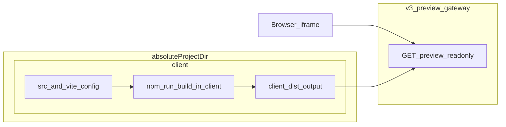

# Code 业务区 v4（Project：从单页 HTML 到 Client 工程）

**状态**：v4 需求说明（产品形态与运行时契约）  
**关联**：

- 磁盘与工作区边界仍以 [Code 业务区 v2](./v2.md) 为准（`absoluteProjectDir`、Agent 工具约束）。
- 只读预览 HTTP 面仍以 [Code 业务区 v3](./v3.md) 为准（路径守卫、MIME、`GET …/preview/…`）；v4 **不替代** v3 网关实现，只扩展「工作区内应长成什么样、iframe 应以哪套静态文件为权威」。
- 宿主会话端消费方式见 [Code 业务区 v4（client）](../../../../client/docs/design/code/v4.md)（与本文同步迭代）。

**定位**：在 v2/v3 已确定的 **磁盘真相 + 静态预览网关** 之上，将每个 project 的代码工作区从「根目录单文件 HTML / 手写多文件静态站」的自然延伸，升级为 **位于工作区子目录 `client/` 下的、与 monorepo 内 `@gepick/client` 选型对齐的标准 Client 工程**（Vite + React + TypeScript + Tailwind 等）。**同一 project 工作区根下**后续可并列其它子目录（如 **`server/`**），本版 **仅规范 `client/`**。**v4 与线上预览衔接的唯一运行时形态**仍是 **构建后的静态 Web 资源**（`index.html` + JS/CSS 分包与静态资源），与过去「最终仍是一组可由网关提供的 HTML/CSS/JS 文件」一致，只是工程化源码与 **`npm run build`（或等价）** 均发生在 **`client/`** 内。**开发服务器预览（dev serve）、反向代理 Vite dev、HMR 等不属于 v4**，留待后续版本单独规划。

---

## 1. 设计目标

1. **工程形态对齐**：在 **v2 约定的 project 工作区根**（`absoluteProjectDir`，磁盘上通常为 `.projects/{projectId}` 或由 `GEPICK_PROJECTS_ROOT` 决定）之下，以子目录 **`client/`** 作为前端应用根，默认（或通过初始化脚手架）具备：`client/package.json`、`vite.config`、`src/`、`index.html`（Vite 源码入口）、工具链配置文件等；依赖集合与 `@gepick/client` **同栈**（见 §2）。**不与**会话宿主 `packages/client` 混淆；此处指 **用户 project 磁盘上的 `…/client/`**。
2. **预览真相为静态产物**：会话内 iframe 若展示「可运行的前端应用」，**仅**以 **`client/` 内 `vite build` 产出**（默认 **`client/dist/`**）下的 **`index.html` 及其相对引用**为入口；与 v3 预览网关 **同源、多资源链式加载** 模型一致（相对路径为 **`client/dist/...`**，见 §3.2），无需在 v4 引入第二套预览协议。
3. **与 v2/v3 安全模型一致**：预览文件仍只能来自 **`path.resolve(absoluteProjectDir, rel)`** 且通过前缀校验；不显式放宽对 `node_modules` 等目录的暴露策略（具体是否允许经 `rel` 访问以实现阶段与威胁模型对齐，首版建议 **仅服务构建结论与 `public` 产物路径**，避免将整棵依赖树变成可枚举静态站）。
4. **前端边界清晰**：**一切前端源码与构建产物均在 `client/` 下**；工作区根 **不**再承载「预览用 HTML」——**`{projectId}/client` 即全部前端代码**（另见 §3.1）。
5. **依赖版本可治理**：用户侧各 project 的 **`client/` 以产品提供的基准 `package.json`（项目模板）为起点**，使 **多项目依赖版本尽可能一致**，便于统一定位、复现与修复 **第三方库问题**；细节见 §2.1。
6. **App 源码侧职责分离**：在 `@gepick/app` 内将原 **`src/code`** 拆分为 **`preview`**（静态预览网关能力）与 **`client-dev`**（用户工作区 `client/` 脚手架、基准模板、未来 dev 编排等），目录见 §9；便于演进且与「用户磁盘上的 `client/`」一词区分。

---

## 2. 技术选型（v4 首版）

与 [`packages/client/package.json`](../../../../client/package.json) 所在 monorepo 内的 **`@gepick/client`** 对齐，典型包括（以仓库当前依赖为准，实现时可锁版本）：

| 类别 | 依赖 / 工具 |
|------|----------------|
| 运行时 | `react`、`react-dom` |
| 构建 | `vite`、`typescript` |
| UI / 样式 | `tailwindcss`、`@tailwindcss/vite`、`clsx`（及 client 侧常用的 `tailwind-merge` 可按需纳入模板） |
| React 插件 | `@vitejs/plugin-react` |
| 图标 | `lucide-react` |
| 状态 | `zustand` |
| 质量 | `eslint` 及与 client 一致的 ESLint/TS 插件集 |

**说明**：前端工程物理路径为 **`{absoluteProjectDir}/client/`**（口语可记「每个 project 下 `./project/{projectId}/client`」与 **工作区根 + `client`** 同构，具体根目录名以 v2 为准）。

### 2.1 基于 `package.json` 的项目模板与版本统一

**动机**：若由各 project、各次 Agent 会话 **自由手写** `dependencies` 版本，易出现 **多项目之间 semver 发散**——同一第三方缺陷在部分 project 可复现、部分不可，**全局 bugfix（含安全补丁）难以一次性覆盖**，排障成本高。

**约定**：

1. **基准模板**：产品维护 **一份（或少量分级）权威的 `package.json` 模板**，作为新建 `client/` 的 **唯一依赖声明基线**；模板中 **`dependencies` / `devDependencies` 使用确定版本或与 monorepo 对齐的约束**（实现上可从仓库根 **pnpm catalog**、或自 [`@gepick/client`](../../../../client/package.json) **抽取/导出**生成，以保持与宿主技术栈同源升级）。
2. **落地方式**：初始化脚手架将 **上述模板写入** `absoluteProjectDir/client/package.json`（并可配合 **锁文件策略**，如首次 `npm install` 生成 `package-lock.json`，或由产品侧提供 **推荐 lock 快照** 以降低漂移——具体由实现选型）。
3. **多项目一致**：在「用户多 project」维度，**默认**均起自 **同一模板代次**；产品发布 **模板升版**（例如统一修复某 React 版本问题）时，可通过 **文档、提示或后续工具** 引导将各 project 的 `client/package.json` **对齐到新模板**，使 **三方问题可在统一版本面** 上解决，而不是每项目一处版本、无法合并处理。
4. **Agent 边界**：**优先**在不变更 major 依赖版本的前提下修改业务代码；若需调整依赖版本，应与 **当前产品模板** 一致或经用户明确授权，**避免**在对话中随机抬版本导致重新陷入分散状态（可在 system prompt 中简短声明）。

**与「不将用户 workspace 并入 monorepo」不矛盾**：版本统一依靠 **同源模板文件拷贝 + 相同 semver**，不要求用户目录成为 workspace 成员。

---

## 3. 目录与构建契约

### 3.1 建议的标准树（逻辑结构）

下列为 **说明用** 的最小示意：Vite 工程根在 **`client/`**；文件名以 Vite 常规约定为准。

```text
{absoluteProjectDir}/                 # v2 project 工作区根（如 .projects/{projectId}）
  README.md                           # 可选；v2 占位
  client/                             # 【v4】**全部**前端代码与 Vite 工程根（仅此目录）
    package.json
    vite.config.ts
    tsconfig.json
    eslint.config.*（或 .eslintrc，与栈一致即可）
    index.html                        # Vite HTML 入口（源码）
    src/
      main.tsx
      …
    public/                           # 构建时原样拷贝至 dist
    dist/                             # `npm run build` 产出；**静态预览的首选根（相对工作区根为 client/dist）**
    node_modules/                     # 建议在 client 内安装；**不应**作为预览「站点根」刻意暴露（见 §1 目标 3）
  server/                             # 【后续版本】服务端代码；v4 本文仅预留目录概念，不作契约
```

### 3.2 预览入口语义（产品契约）

预览 URL 的 `path` 段均为相对于 **`absoluteProjectDir`** 的 `rel`（与 v3 一致）。

- **唯一权威入口**：可运行的 iframe 预览以 **`client/dist/index.html`** 为入口（经 v3 网关即 **`rel = client/dist/index.html`**）；子资源（如 **`./assets/*`**）相对文档 URL 解析，落在 **`client/dist/`** 树下。
- **未有构建产物时**：若不存在 **`client/dist/index.html`**，预览侧表现为 **空/错误提示**（例如引导在 `client/` 内执行构建），**不**使用工作区根或其它路径代替（与「前端仅在 `client/`」一致）。

### 3.3 构建与依赖

- 前端依赖安装与构建的 **`cwd` 为 `{absoluteProjectDir}/client`**（首版推荐 **直接在 `client/` 内 **`npm install`（或 `pnpm install`）** 与 **`npm run build`**）。
- **`client/package.json` 以 §2.1 基准模板为纲**；锁文件落在 **`client/`**（如 `package-lock.json`），与模板共同保证 **可复现安装**、并支撑多项目 **同代模板** 下的版本治理。

---

## 4. 与 v3 预览网关的关系

- **无新协议**：仍通过 v3 已定义的只读 **`GET`** 预览路由返回字节流与 **Content-Type**；路径段仍先归一为相对 `rel` 再套用 v2 **§3.4** 守卫。
- **唯一变化在「约定哪条 rel 作为默认入口」**：由 app + client v4 文档约定 **固定 `client/dist/index.html`**（及「无则不可预览」），而非改变预览模块（见 §9 **`preview/`**）的路径解析算法本身。



---

## 5. 初始化与 Agent 边界

- **脚手架**：建议在 **创建 project** 或 **首次进入 code 工作区** 时，由服务端或受信流程在 **`absoluteProjectDir/client/`** 写入 **最小可构建模板**；其中 **`package.json` 必须来自 §2.1 的基准模板**（与 `@gepick/client` 栈同源），其余文件（`vite.config`、`src/`、`index.html`、ESLint 等）可一并由模板包提供。工作区根可保留简短 `README.md`。目标是 **`cd client` → `install` → `build`** 路径稳定、**依赖版本跨 project 可控**。
- **Agent**：在 [system prompt 或等价约定](../../../src/agent/prompt.ts) 中明确 **前端根为 `client/`**、栈名、**在 `client/` 下执行的** 构建命令、预览依赖 **`client/dist`**；**实现上须要求** 以 **Vite 工程结构** 写代码：业务在 **`client/src/`**（React/TS），**`client/index.html` 仅作 Vite 薄壳**；**禁止**以「根目录 `index.html` + 独立 `*.js` + CDN」作为**默认**主工程形态（除非用户显式要求纯静态页）。不得把用户消息中的路径当磁盘根，仍以 v2 **工具与工作目录约束** 为准；bash 的 **`cwd` 为工作区根** 时，用 **`cd client && …`** 跑 npm/vite。

---

## 6. 非目标（v4）

- **开发服务器预览**：本地或远端 **`vite dev`**、网关反向代理到 dev 端口、**HMR** 等。
- **Git / GitHub / 在线部署**：与 v2 §8 一致，不在 v4 首版展开。
- **自动跨 project 批量改写字面 `package.json` 的运维系统**：§2.1 要求 **模板与对齐策略**；全量自动化「抬版本到所有历史 project」可作为后续增强，**不**作为 v4 首版 DoD。

---

## 7. 验收标准（DoD）

- 按模板初始化后的 project，在 **`client/` 内完成依赖安装与构建** 后，`client/dist/index.html` 可通过 v3 预览路由在 iframe 中加载，且 **CSS/JS/静态资源** 相对引用可链式加载成功（在浏览器安全策略允许范围内）。
- **路径穿越与越权访问**仍被拒绝，行为与 v3 DoD 一致。
- 文档（本文 + client v4）对 **预览入口仅为 `client/dist/index.html`**、**静态产物为唯一 v4 运行时衔接**、**`client/package.json` 来自基准模板以利于版本统一**、**dev serve 不属于 v4** 描述一致。

---

## 8. 修订记录

| 日期 | 说明 |
|------|------|
| 2026-04-28 | 初稿：v4 将 HTML 扩展为 client 工程；静态构建产物为预览权威；栈与 `@gepick/client` 对齐；非目标含 dev serve。 |
| 2026-04-28 | 修订：前端仅在 **`client/`**（**`…/client` 即全部前端代码**）；预览入口唯一 **`client/dist/index.html`**，取消工作区根 **`index.html`**；预留 **`server/`**。 |
| 2026-04-28 | 增补 §2.1：**以基准 `package.json` 为项目模板**，统一多 project 依赖版本与三方问题治理；不要求用户 workspace 并入 monorepo。 |
| 2026-04-28 | 新增 §9：`packages/app/src/code` 拆分为 **`preview/`** 与 **`client-dev/`**；与 **用户磁盘 `client/`** 区分。 |
| 2026-04-28 | §5 Agent：补充 **必须以 `client/src/` + Vite 壳** 协作，弱化 HTML+根目录 JS+CDN 默认心智。 |

---

## 9. `@gepick/app` 源码：`code` 业务块拆分（v4）

为实现 **预览** 与 **用户 client 工程/dev 相关能力** 边界清晰，将 **`packages/app/src/code/`** 进一步划分为子目录（实现时可增量迁移现有文件；以下为 **目标拓扑与职责**）。

### 9.1 目录布局（目标）

```text
packages/app/src/code/
  path-guard.ts              # 【可选保留在根】或迁入 shared：跨预览/工作区的路径校验（若多处共用）
  preview/
    …                        # 静态预览：读盘、MIME、服务于 GET …/preview/… 的实现入口
  client-dev/
    …                        # 用户 project 下 client/：workspace 初始化、基准 package.json 模板、后续 dev 编排（v4 仅脚手架与模板）
```

命名说明：**`client-dev`** 表示 **「宿主 App 内、围绕用户 client 工程的开发侧能力」**，**不是**用户磁盘上的 `absoluteProjectDir/client/`；后者仍简称 **用户 `client/`**。

### 9.2 职责边界

| 子模块 | 职责（摘要） | v4 范围内 |
|--------|----------------|-----------|
| **`preview/`** | 与工作区 **只读预览 HTTP** 相关：`rel` 解析、读文件、`Content-Type`（及与 [v3](./v3.md) 网关 handler 的衔接）；**不包含**业务 HTML 字符串拼接 | 与现网 v3 预览行为一致，入口 **`client/dist/index.html`** 的约定由路由/handler 与宿主 client 对接 |
| **`client-dev/`** | **`ensureCodeWorkspace` 扩展**、**基准 `package.json` 模板**落地、`client/` 目录脚手架；**未来** **dev serve**、代理 Vite dev、与构建诊断等 **入口归此**，避免与预览读盘耦合 | v4：**模板 + 初始化**；**不**实现 dev serve（见 §6） |
| **根目录 / 共享** | `path-guard`、对 **`absoluteProjectDir`** 的 **安全 join** 等 **多处复用** 逻辑；若仅预览使用可放在 `preview/` 内，避免过早抽象 | 以 **单一事实** 为原则，避免两套路径算法 |

### 9.3 与 HTTP 层的衔接

- **Project controller**（或等价路由模块）中：预览路由 **import** 自 **`code/preview/`**；若未来存在「client 开发辅助 API」，**import** 自 **`code/client-dev/`**。
- **`codeService` 一类聚合**：实现期可保留薄 **facade** 再委托子目录，或 **删除聚合**、由路由直接调用子模块，二者择一并在 OpenAPI/实现注释中保持一致。

---

*若与 [v2](./v2.md) 的磁盘根、§3.4 路径算法或 [v3](./v3.md) 网关行为冲突，**以 v2/v3 及代码实现为准**，并回修本文。*
