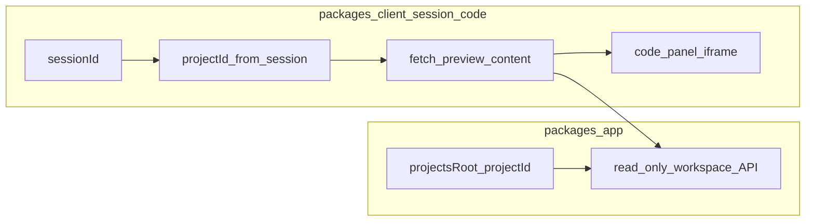

# Code 业务区 v2（对齐服务端工作区真相）

**状态**：v2 需求说明（前端迁移方案）  
**关联**：

- 服务端权威规范：[Code 业务区 v2（app）](../../../../app/docs/design/code/v2.md)（**以后端文档与 `packages/app` 实现为准**）。
- 迁出来源：[Code 业务区 v1](./v1.md)（正文抽 HTML 的最小闭环）。
- 会话布局：[会话界面 v5](../session/v5.md)。

**定位**：将 client 侧 code 业务从 v1 的「以 assistant 正文为预览真相」迁移为「以服务端 `.projects/{projectId}` 磁盘树为用户应用真相」，通过 **受控只读 API** 拉取入口文件并在 slot 内预览，从而与 **server v2** 一致。

---

## 1. 为何从 v1 重构为 v2

### 1.1 v1 的局限（相对 server v2）

| 维度 | v1（client） | server v2 |
|------|----------------|-----------|
| 可运行代码的权威来源 | assistant **text** 中嵌入的 HTML | **`<projectsRoot>/{projectId}`** 目录（Agent 工具读写） |
| 与 Agent 实际产物关系 | 正文可能与磁盘不一致或缺失整页 HTML | 磁盘为唯一权威；SSE 仅摘要工具结果 |
| 后端契约 | 不新增 API | 工作区路径由服务端解析，与 `projectId` 绑定 |

在 server v2 下，Agent 可能 **只在工作区内写 `index.html` 等文件**，而在聊天里只输出短摘要；此时 v1 的 `extract-html-from-message` **无法**还原真实可运行应用，slot 预览与「用户 app」脱节。

### 1.2 v2 客户端原则

1. **以后端 Code v2 为单一事实来源**：目录语义、`projectId` 与磁盘路径的绑定方式，均以 [app code v2](../../../../app/docs/design/code/v2.md) 及 `packages/app` 代码为准，本文只描述 **client 侧消费方式**。
2. **预览内容反映磁盘真相**：iframe（或等价容器）展示的 HTML 应来自 **服务端按 `projectId` 提供的只读文件内容或受控 URL**，而非推断 assistant 正文。
3. **client 不直连磁盘、不猜路径**：仅持有当前会话上下文的 **`projectId`**（来自已有 Session 模型），通过 **HTTP/SDK** 请求后端；路径解析与越界校验 **全部在后端**完成，与 Agent 工具同一套守卫规则。

---

## 2. v2 技术方案总览

### 2.1 数据流（目标态）



1. 用户在同一 Project 下使用 Session（沿用现有 **Project → Session**，会话上已有 **`projectId`**）。
2. Agent 在服务端工作区内迭代文件；消息/SSE 仍用于 Chat 展示，**不作为**预览 HTML 的主来源。
3. Client 在适当时机（消息列表更新后、用户点击「重新加载」、或防抖轮询）调用 **只读接口**，读取约定 **预览入口文件**（默认见下节），更新内存态并刷新 iframe。

### 2.2 预览入口约定

- **默认入口文件名**：建议固定为 **`index.html`**（相对项目根）。若将来需多入口，再由服务端或配置扩展（非本文首版必需）。
- **编码**：UTF-8；非法或缺失文件时，业务区进入 **error / empty**  state，并展示可读错误信息（不写死英文亦可）。

### 2.3 服务端能力（client 依赖，由 app 实现）

以下接口形态为 **约定**，路径与字段以实现为准，但必须满足：

- **输入**：能定位到「当前用户的某个 `projectId`」下的相对路径（如 `index.html`）；鉴权与用户身份绑定方式与现有 API 一致。
- **行为**：服务端使用与 Agent 相同的 **`resolveAbsoluteProjectDir(projectId)` + 相对路径规范化 + 前缀校验**，禁止路径穿越；仅允许读取（不写）。
- **输出**：文件正文（如对 HTML 返回 `text/html` 或纯文本由实现选择）或明确 404。

Client 通过 **`@gepick/sdk`** 增加对应方法为宜，避免手写平行 HTTP（参见 client 规范）。

### 2.4 Client 模块改造要点

| 模块 | v1 行为 | v2 目标 |
|------|---------|---------|
| `build-code-view-model.ts` | 仅从消息中拼 assistant **text**，再 `extractHtmlFromMessage` | **优先**：根据 **`projectId`** 调只读 API 拉取入口 HTML；失败时可 **可选降级**（见 2.5） |
| `extract-html-from-message.ts` | 唯一真相路径 | **降级路径**：仅在 API 不可用或约定关闭时使用，避免与磁盘冲突 |
| `code-store.ts` | 按 `sessionId` 存 HTML 字符串 | 保持按会话维度缓存；可增加「最后拉取时间 / etag」避免重复请求（可选） |
| `code-panel.tsx` | `srcDoc={html}` | 维持 iframe 隔离；内容改为 **API 返回的磁盘文件内容**；`reload` 触发重新 fetch |

**触发刷新时机（建议）**：

- Session 消息列表因 SSE 更新后 **防抖**拉取预览（避免每 token 打爆接口）；
- 用户点击「重新加载」立即拉取；
- 切换 `sessionId` / `projectId` 时重置并拉取。

### 2.5 与 v1 的兼容策略（可选）

- **推荐**：生产路径仅走「磁盘真相 + API」。
- **可选降级**：开发环境或开关打开时，若 API 404 且无文件，可回退 v1 文本抽取，并在 UI 标明「预览来自聊天抽取，非工作区文件」——避免静默不一致。**默认是否开启由产品决定**。

---

## 3. 实现范围（client v2 首版）

- 增加 **拉取工作区预览文件** 的数据通路（SDK + store 或 session 层触发）。
- **重构** `build-code-view-model`：**主路径**依赖 `projectId` + 只读 API，而非仅扫描 assistant text。
- **文档与注释**：在 v1 遗留模块处标明「降级用」避免后续误用。
- **非目标**：文件树编辑器、Git、在线部署、绕过服务端的本地路径配置。

---

## 4. 验收标准（DoD）

- Agent 仅在磁盘更新 HTML、assistant 正文未贴完整 `<html>` 时，slot 仍能展示 **与工作区 `index.html`（或约定入口）一致** 的预览。
- 切换不同 Session（不同 `projectId`）时，预览与对应 **project 工作区**一致，不串项目。
- 刷新页面后：若实现会话历史拉取与再次 fetch，可恢复预览；若首版仍仅内存态，需在文档中声明（与 v1 一致或改进项单独列出）。
- 不破坏现有 session 发送消息、SSE、历史加载链路。

---

## 5. 目录建议（演进）

在现有 [v1 目录建议](./v1.md#44-目录建议) 基础上可增加：

```text
packages/client/src/session/code/
  ...
  fetch-project-preview.ts          # 调用 SDK 拉取入口 HTML（或薄封装）
  build-code-view-model.ts          # v2：优先 API，可选降级 v1 抽取
```

具体文件名保持仓库 **kebab-case** 约定。

---

## 6. 修订记录

| 日期 | 说明 |
|------|------|
| 2026-04-28 | 初稿：client v2 定位、相对 server v2 的真相源、从 v1 重构的技术方案与 DoD。 |
