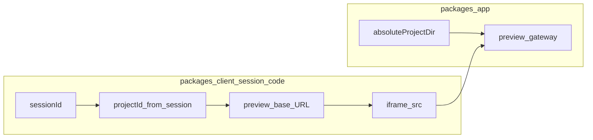

# Code 业务区 v3（预览：受控路由 / 同源资源）

**状态**：v3 需求说明（前端迁移方案）  
**关联**：

- 服务端权威规范：[Code 业务区 v3（app）](../../../../app/docs/design/code/v3.md)（**预览网关路径、MIME、鉴权与守卫以 app 文档及实现为准**）。
- 前置版本：[Code 业务区 v2](./v2.md)（磁盘真相、`projectId`、单文件只读拉取与 `srcDoc` 主路径）。
- 会话布局：[会话界面 v5](../session/v5.md)。

**定位**：在 v2「**拉取入口 HTML 正文 → iframe `srcDoc`**」能覆盖单文件预览的基础上，将 **主路径**升级为 **iframe `src` = 服务端受控预览基址**（见 app v3），使 `index.html` 内 **相对路径引用的 CSS/JS/静态资源**可随浏览器子请求加载，行为更接近真实站点；**权威来源仍为**服务端工作区磁盘，不从 assistant 正文推断。v2 的读文件 API 可作为 **降级/辅助**保留。

---

## 1. 为何在 v2 之后引入 v3

### 1.1 v2 客户端主路径仍有的局限

| 维度 | v2（client 主路径） | v3 目标 |
|------|---------------------|---------|
| iframe 装载方式 | 将 **整段 HTML 字符串** 注入 **`srcDoc`** | **`src`** 指向 **同源受控预览 URL**，由浏览器按文档 URL 解析相对路径 |
| 多资源站点 | `./style.css`、`./app.js`、`assets/*` 等相对 URL 常 **无法**在 `srcDoc` 场景下正确解析（无稳定 document URL / base 行为与真站不一致） | 子资源请求走 **同一预览前缀**，与磁盘目录结构一致 |
| 与产品预期 | 单文件 HTML 小游戏/单页足够 | Agent 生成 **多文件** 前端小项目时，slot 体验与本地打开 `index.html` **更一致** |

v2 文档已允许「**受控 URL**」；v3 将其 **落实为默认主路径**，并细化 client 侧契约。

### 1.2 v3 客户端原则

1. **仍以 app v2/v3 为单一事实来源**：`projectId`→磁盘路径由服务端决定；预览 **URL 形态与鉴权**以 [app code v3](../../../../app/docs/design/code/v3.md) 为准。
2. **预览主路径**：优先 **`iframe src = previewBaseUrl`**（指向入口 **默认仍为 `index.html`**，或由网关「目录默认入口」解析，见 app v3 §2.1）。
3. **降级可选**：当预览路由不可用、环境关闭多资源预览、或仅需快速文本预览时，可继续使用 v2 **`readWorkspaceFile` + `srcDoc`**；须在 UI 或文档区分布局上区分「路由预览」与「字符串预览」，避免静默不一致。
4. **不直连磁盘、不猜路径**：client 仅持有 **`projectId`**，预览地址通过 **配置基址 + `projectId` + SDK/常量**组装，或由后端返回 **canonical 预览 URL**（若将来提供专用字段/接口）。

---

## 2. v3 技术方案总览

### 2.1 数据流（目标态）



1. 会话上下文中解析 **`projectId`**（同 v2）。
2. 构造 **预览基址**（与 app 注册的预览路由一致，含必要认证语义：Cookie 同源或后续 token）。
3. **`code-panel`** 使用 **`iframe src={...}`**；用户「重新加载」即 **reload iframe** 或 **URL 加 cache-bust query**。
4. Agent 变更文件后：仍可通过 SSE 防抖触发 **reload**（与 v2 触发频率建议一致），无需把 HTML 全文再走一遍 Chat。

### 2.2 预览入口与 URL 约定

- **默认入口**：与 v2 一致，相对项目根 **`index.html`**；若服务端对「目录 URL」默认返回 `index.html`，client 可将 `src` 设为「项目预览根 `/`」或显式 `/index.html`，**以实现与 OpenAPI 为准**。
- **同源**：预览域名与 API 同源时，浏览器自动携带会话 Cookie（若当前鉴权依赖 Cookie）；跨子域则需 app 另行约定（列 app v3 §8）。
- **编码**：仍要求工作区文本 UTF-8；网关 404 时 slot 展示 **error / empty**。

### 2.3 服务端能力（client 依赖）

除 v2 **单文件读取**外，依赖 app v3 **预览网关**（详见 app 文档）：

- 对 **`projectId`** 下相对路径资源的 **GET**、正确 **MIME**、与 v2 **相同路径守卫**。
- client 侧需已知 **预览路径前缀模板**（或由环境变量/构建期注入 **API origin**）。

### 2.4 Client 模块改造要点

| 模块 | v2 行为 | v3 目标 |
|------|---------|---------|
| `code-panel.tsx` | 主路径 **`srcDoc={html}`** | 主路径 **`src={previewUrl}`**；可选保留 **`srcDoc`** 降级分支 |
| `fetch-project-preview.ts`（或等价） | 拉取 **HTML 字符串** | 拆/扩：**解析预览 URL**、或 **继续拉字符串供降级**；命名可演进为 `workspace-preview.ts` 等（保持 kebab-case） |
| `build-code-view-model.ts` | 视图模型含 **html 字符串** | 视图模型含 **`previewUrl`**（及可选 **fallbackHtml**）；优先级：**URL 模式 > srcDoc** |
| `code-store.ts` | 缓存 HTML | 缓存 **previewUrl**、可选 **reloadNonce** / 最后刷新时间；降级时再缓存 HTML |

**触发刷新时机（建议）**：与 v2 一致——SSE 防抖、用户手动重载、切换 session/project 时重置。

### 2.5 与 v2 / v1 的兼容策略

- **推荐**：多资源场景 **必须**走 v3 预览路由。
- **v2 字符串路径**：单文件、无外链、或网关未部署时启用。
- **v1 正文抽取**：仅作与 v2 相同的 **最后降级**（见 v2 §2.5），且 **明示**用户。

---

## 3. 实现范围（client v3 首版）

- 增加或调整 **预览基址构造**与 **iframe `src` 主路径**。
- **`code-panel` / store / view-model** 支持 **`previewUrl`** 状态与 reload。
- **SDK**：若预览 URL 完全由 client 拼接，则可能无需新方法；若后端下发 canonical URL，则 **@gepick/sdk** 增加字段或接口（以实现为准）。
- **非目标**：文件树编辑器、Git、在线部署、绕过服务端的本地路径配置（与 v2 §3 一致）。

---

## 4. 验收标准（DoD）

- 工作区内 **`index.html` + 相对路径 CSS/JS** 时，slot 内 iframe **能展示样式与脚本效果**（在浏览器安全策略允许范围内）。
- 仅有单文件 `index.html`、无子资源时，行为与 v2 **等价或更好**（至少可退回 `srcDoc`）。
- 切换 Session / `projectId` 时预览 **不串项目**。
- 刷新页面后：若能从会话恢复 `projectId` 并重建预览 URL，则应恢复预览；否则在文档或代码注释中声明限制。
- 不破坏 session 发消息、SSE、历史加载链路。

---

## 5. 目录建议（演进）

在 [v2 目录建议](./v2.md#5-目录建议演进) 基础上可演进为：

```text
packages/client/src/session/code/
  ...
  workspace-preview.ts              # 预览 URL 构造 + 可选降级拉取 HTML
  build-code-view-model.ts          # v3：previewUrl 优先，其次 v2 字符串，最后 v1
  code-panel.tsx                    # iframe src / srcDoc 分支
```

具体文件名保持仓库 **kebab-case** 约定；是否重命名 `fetch-project-preview.ts` 由实现时增量决定。

---

## 6. 修订记录

| 日期 | 说明 |
|------|------|
| 2026-04-28 | 初稿：v3 受控路由预览定位、相对 v2 的增量、模块表与 DoD。 |
