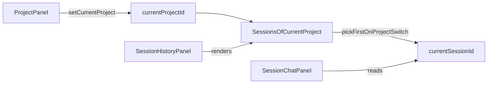

# 会话界面 v4

**状态**：v4 需求说明（新增 Project 区域与按 Project 管理会话）  
**关联**：[会话界面 v1](./v1.md)（基础布局与交互）；[会话界面 v2](./v2.md)（助手 Markdown）；[会话界面 v3](./v3.md)（会话删除）；[与 gepick-app 配套对接说明](../与-gepick-app-配套对接说明.md)（数据流、API、Zustand、SSE）

---

## 1. 目的与范围

在 **v1-v3 已约定能力**保持不变前提下，v4 引入 `Project` 业务维度，用于组织会话：

- 新增 **Project 区域**（用于创建与切换 Project）。
- 每个 `Project` 拥有一组属于它的 `Session`。
- 用户在某个 Project 下点击不同 Session，可切换到该 Session 的会话交互历史。

v4 不重新定义 Markdown 渲染、发送协议、SSE 消息合并和会话删除规则，仅增加 Project 维度下的会话分组与切换行为。

---

## 2. 整体布局与信息架构

### 2.1 横向布局（v4 定稿）

会话主界面采用三栏布局（从左到右）：

- **左栏：Project 区域**（展示 Project 列表与创建入口）。
- **中栏：Chat 主区**（沿用 v1/v2）。
- **右栏：Session 历史区**（展示“当前 Project 下”的 Session 列表）。

当系统中**尚未创建任何 Project**时，采用首屏空态布局：

- 仅展示 **Project 区域** 与 **Chat 主区**；
- **不展示 Session 历史区**（右栏隐藏）；
- 待用户创建首个 Project 后，再展示 Session 历史区并进入常规三栏布局。

### 2.2 区域职责

- **Chat 主区**：展示 `currentSessionId` 对应消息流，并承载发送区。
- **Session 历史区**：仅显示 `currentProjectId` 作用域内的 Session 项。
- **Project 区域**：显示所有 Project 历史，负责 Project 创建与切换。

---

## 3. Project 区域交互

### 3.1 展示内容

- 区域顶部提供 **创建 Project** 按钮（文案可配置，如「新建 Project」）。
- 区域主体展示全部已创建 Project 列表（可滚动）。
- New Project 的 title 展示直接使用 `project.id` 的截断值：保留前缀与下划线，并拼接下划线后前 6 位（例如 `prj_230736526ffeBfWEZIkEcheMWQ` 展示为 `prj_230736`）。
- 当前激活 Project 需要有明确高亮态（背景/边框/文字色等任意可区分方案）。

### 3.2 创建 Project

- 点击创建按钮后通过 `@gepick/sdk` 客户端实例调用 Project 创建能力（对应服务端创建 Project 语义）。
- 创建成功后：
  - 在 Project 列表中新增该项；
  - 自动将其设为当前 Project（`currentProjectId`）；
  - 右栏 Session 历史切换为该 Project 下 Session 列表。
- 若新 Project 初始无 Session，Chat 主区显示空态（见 §4.3）。

### 3.3 切换 Project

- 点击 Project 列表项可切换当前 Project。
- 切换后必须同步更新：
  - `currentProjectId`；
  - 右栏 Session 列表数据源（改为新 Project 下 Session）；
  - `currentSessionId`（规则见 §4.2）。

---

## 4. Project 与 Session 映射规则

### 4.1 映射关系

- 一个 Project 对应多个 Session（`1:N`）。
- 一个 Session 仅属于一个 Project（v4 不支持跨 Project 复用同一 Session）。
- Session 查询与切换默认在当前 Project 作用域内进行。

### 4.2 切换 Project 后默认 Session 选择

v4 定稿规则：

- 当切换到某 Project 时，`currentSessionId` 设为该 Project 的**第一个 Session**。
- 这里的“第一个”以当前前端展示顺序为准（通常与列表顺序一致）。
- 若 Project 下 Session 列表为空，则 `currentSessionId = null`。

### 4.3 空 Project 行为

当 `currentProjectId` 存在但其 Session 为空时：

- 右栏显示“当前 Project 暂无会话”类空态提示；
- 中栏 Chat 显示空态，不展示历史消息；
- 发送区是否可直接触发“创建首个 Session”由实现决定，但需在《配套对接》补齐。

当 `projects.length === 0`（即无任何 Project）时：

- 右栏 Session 历史区不渲染；
- 左栏 Project 区域展示“创建首个 Project”引导；
- 中栏 Chat 显示“请先创建 Project”空态提示。

### 4.4 在 Project 内切换 Session

- 用户在右栏点击某 Session 项时：
  - 仅在 `currentProjectId` 对应列表内切换；
  - 更新 `currentSessionId`；
  - 中栏 Chat 恢复并展示该 Session 历史交互（命中缓存或拉取服务端）。

---

## 5. 状态与前端数据模型建议（Zustand）

在现有 `sessionStore` 基础上，建议新增或等价表达：

- `projects: ProjectSummary[]`
- `currentProjectId: string | null`
- `sessionsByProject: Record<ProjectId, SessionSummary[]>`
- `setCurrentProject(projectId: string): Promise<void> | void`
- `createProject(input?): Promise<void>`

并与现有状态协同：

- `currentSessionId` 受 `currentProjectId` 约束；
- `messagesBySession` 继续按 `sessionId` 索引，不改消息结构；
- 本地持久化可新增 Project 维度键（如 `STORAGE_PROJECT_ID`），与 `STORAGE_SESSION_ID` 协同恢复。

---

## 6. API 与后端边界（v4 增量）

v4 需要在《配套对接》补充 Project 相关能力，至少包括以下语义能力：

- 创建 Project
- 获取 Project 列表
- 获取某 Project 下 Session 列表（或复用 Session 列表能力并带 `projectId` 过滤）

前端职责：

- 使用 `packages/client/src/util/sdk.ts` 中的 `sdk` 实例（`createOpencodeClient` 生成）直接调用 server app API，采用 SDK 生成的 RPC 风格函数；
- 不要求、也不建议在 v4 额外手写一层 Project HTTP 接口封装；
- Project 切换时按 §4.2 计算默认 Session；
- 不在 v4 改动消息协议与 SSE 事件结构（如无后端新增事件需求）。

---

## 7. 设计代码目录（在 v1-v3 基础上增量）

建议目录如下：

```text
packages/client/src/
  session/
    session-page.tsx                  # 三栏装配：左 chat / 中 history / 右 project
    history/
      session-history-panel.tsx       # 当前 Project 下的 Session 列表
    chat/
      session-chat-panel.tsx          # 当前 Session 的消息区与发送区
    project/                          # v4 新增子域
      project-panel.tsx               # Project 列表 + 创建按钮
      project-list-item.tsx           # Project 单项
      index.ts
```

约束：

- 保持按业务域组织，不新增按技术角色横切的顶层目录。
- 新增 TypeScript/TSX 文件名使用 kebab-case。

---

## 8. 与 v1/v2/v3 的边界

- **v1**：仍是会话主界面；v4 将其两栏扩展为三栏并引入 Project 作用域。
- **v2**：助手 Markdown 渲染策略不变（`react-markdown` + `remark-gfm` + `rehype-sanitize`）。
- **v3**：Session 删除能力保留；删除后仅影响其所属 Project 的 Session 列表与选中迁移。
- v4 不覆盖以下主题：权限模型、多人协作、Project 删除/归档、跨 Project 拖拽迁移 Session。

---

## 9. 关系示意（实现导向）



---

## 10. 验收标准

- 文档明确三栏布局为：`Project区域 -> Chat -> Session历史`。
- 文档明确当 `projects.length === 0` 时，不展示 Session 历史区域。
- 文档明确 Project 切换默认规则为：选该 Project 的第一个 Session。
- 文档明确空 Project 空态与 Session 作用域切换行为。
- 文档明确与 v1-v3 的兼容边界，且可直接指导后续实现拆解。

---

## 11. 修订记录

| 日期 | 说明 |
|------|------|
| 2026-04-27 | 首版：新增 Project 区域；定义 Project 创建/切换、Project-Session 映射、切换默认选中规则（三栏布局下切换到 Project 时默认选第一个 Session）。 |
| 2026-04-27 | 调整布局顺序为「左 Project / 中 Session历史 / 右 Chat」，并同步无 Project 场景下的区域可见性描述。 |

