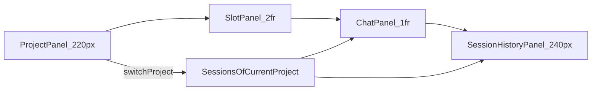

# 会话界面 v5

**状态**：v5 需求说明（新增业务 Slot 区并调整布局比例）  
**关联**：[会话界面 v4](./v4.md)（Project 维度与三栏布局）；[会话界面 v3](./v3.md)（会话删除）；[与 gepick-app 配套对接说明](../与-gepick-app-配套对接说明.md)

---

## 1. 目的与范围

在 v4 能力保持不变（Project 维度、Session 切换、聊天与 SSE 交互）的前提下，v5 聚焦布局升级：

- 在 `Project` 区域右侧新增一个 `Slot` 业务占位区域；
- 调整主内容区比例为 `Slot : Chat = 2 : 1`（在保持 Slot 更宽的前提下，适度放宽 Chat）。
- 收窄左右固定栏宽度（Project 与 Session 历史）；
- `Slot` 默认显示空白区域与文案「业务区域」。

v5 不改变会话协议、状态模型、SSE 事件结构与 API 边界。

---

## 2. 布局定义（v5 定稿）

### 2.1 横向布局顺序

会话主界面采用四区布局（从左到右）：

- **左栏：Project 区域**
- **中左：Slot 业务区域（新增）**
- **中右：Chat 主区**
- **右栏：Session 历史区**

其中 `Slot` 必须紧邻 `Project` 区域。

### 2.2 宽度与比例规则

- `Project` 区域宽度：由 `260px` 调整为 **`220px`**。
- `Session 历史` 区域宽度：由 `280px` 调整为 **`240px`**。
- 中间弹性主内容区（`Slot + Chat`）占据剩余宽度，且满足：
  - **`Slot : Chat = 2 : 1`**
  - 等价表达：`Slot ≈ 66.7%`，`Chat ≈ 33.3%`（在中间弹性区内）。

---

## 3. Slot 区域定义（新增）

### 3.1 默认态

`Slot` 区域在 v5 默认提供占位内容：

- 区域主体保持空白视觉；
- 中心展示文案：**「业务区域」**；
- 不承载会话数据读写逻辑，不参与 Session/Message 状态变更。

### 3.2 职责边界

- `Slot` 仅作为后续业务模块的挂载容器；
- 不影响 `Project` 切换、`Session` 切换、消息发送与历史加载流程；
- 在无 Project 场景下，`Slot` 仍可展示默认占位文案（不隐藏）。

---

## 4. 与 v4 的兼容边界

- 保持 `Project -> Session` 的映射规则不变；
- 保持 `currentProjectId` / `currentSessionId` 的行为不变；
- 保持 `messagesBySession` 与 SSE 合并逻辑不变；
- 仅调整页面容器结构与宽度，不新增状态字段。

---

## 5. 设计代码目录（v5 增量）

建议在 `session/` 业务域内新增 `slot` 子域：

```text
packages/client/src/session/
  session-page.tsx
  project/
    project-panel.tsx
  slot/                            # v5 新增子域
    session-slot-panel.tsx         # 默认占位：业务区域
  chat/
    session-chat-panel.tsx
  history/
    session-history-panel.tsx
```

约束：

- 保持按业务域组织，不新增横切式顶层目录；
- 新增文件名遵循 kebab-case；
- `slot` 为独立区域组件，不把占位逻辑散落在 `session-page.tsx` 内联 JSX。

---

## 6. 关系示意（实现导向）



---

## 7. 验收标准

- 文档明确 v5 为四区布局：`Project -> Slot -> Chat -> SessionHistory`。
- 文档明确 `Slot` 紧邻 `Project` 区域。
- 文档明确中间弹性区比例：`Slot : Chat = 2 : 1`。
- 文档明确固定栏缩窄值：`Project=220px`、`SessionHistory=240px`。
- 文档明确 `Slot` 默认展示空白区与文案「业务区域」。
- 文档明确 v5 仅改布局，不改会话协议与状态模型。

---

## 8. 修订记录

| 日期 | 说明 |
|------|------|
| 2026-04-28 | 新增 v5：在 Project 右侧新增 Slot 区，定义 Slot:Chat=2:1，并收窄 Project/Session 历史区宽度。 |

