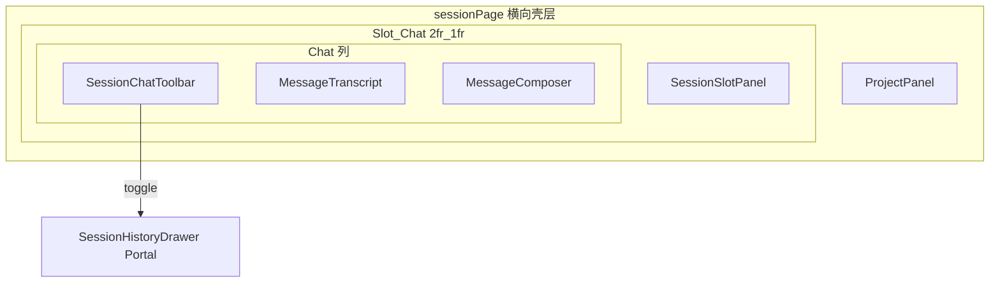

# 会话界面 v6

**状态**：v6 需求说明（Chat 工具栏 + 会话历史抽屉化）  
**关联**：[会话界面 v5](./v5.md)（Slot:Chat 与固定栏宽度）；[会话界面 v4](./v4.md)；[与 gepick-app 配套对接说明](../与-gepick-app-配套对接说明.md)

---

## 1. 目的与范围

在 v5 能力保持不变（Project、Slot、Chat 的 **2:1 弹性区比例**、会话协议、状态模型、SSE）的前提下，v6 聚焦：

- 将 **Chat 主区**由「上下两块」扩展为「**上中下三块**」：顶部 **Chat 工具栏**、中部 **消息列表**、底部 **输入框**；
- **取消右侧常驻「Session 历史」栏**，会话业务壳层在横向只保留 **Project + 主内容区（Slot | Chat）**；
- 通过 **从右侧滑出的抽屉**（**遮罩 mask** + **位移动画**）承载原「会话历史」的列表与交互，**复用**既有历史子域内的列表项、删除确认等组件与 store 行为；
- 在 Chat 工具栏提供 **「新建会话」** 与 **「会话历史」**（历史图标入口）两个按钮。

v6 **不改变**会话 API、`currentSessionId` / `messagesBySession`、SSE 合并与删除会话协议；仅调整布局与历史区的呈现方式。

---

## 2. 布局定义（v6 定稿）

### 2.1 横向布局顺序

会话主界面采用 **三区横向**布局（从左到右）：

- **左栏：Project 区域**（宽度与 v5 一致，见 [v5 §2.2](./v5.md#22-宽度与比例规则)）
- **中栏：弹性主内容区**，内部为 **`Slot | Chat`**，比例仍为 **`Slot : Chat = 2 : 1`**

**不再**存在占用横向空间的「Session 历史」固定栏；历史 UI 通过 **叠层抽屉** 呈现，不占主栅格列。

### 2.2 Chat 列内部（纵向三段）

在 **Chat 列**（弹性区内约 1/3 那份宽度）内部，从上到下：

| 区域 | 职责 |
|------|------|
| **顶部：Chat 工具栏** | 「新建会话」「会话历史」入口；`shrink-0`，与下方消息区视觉分隔 |
| **中部：消息视图容器** | 现有 `MessageTranscript` 滚动区；`flex-1` + `min-h-0`，保持可滚动 |
| **底部：用户输入** | 现有 `MessageComposer`；`shrink-0` |

### 2.3 Session 历史抽屉（叠加层）

- **触发**：点击工具栏「会话历史」图标，切换抽屉开关。
- **位置**：面板从 **视口右侧** 滑入（参考常见 Drawer：白底、阴影；与产品参考图「Versions」侧栏一致交互语义，方向为 **右**）。
- **遮罩**：抽屉打开时，主界面（Project + Slot + Chat）之上覆盖 **半透明深色 mask**，点击 mask **关闭**抽屉。
- **头部**：抽屉内需有明确标题（如「会话历史」）与 **关闭（×）** 按钮。
- **内容**：复用原 `SessionHistoryPanel` 内的 **会话列表、错误提示、删除确认对话框** 等逻辑；顶部原有大块「新建会话」按钮宜 **迁至工具栏**，抽屉内避免重复主按钮（可保留 Project 上下文文案等次要信息）。
- **层级**：抽屉与 mask 的 `z-index` 须 **低于** 已有「删除会话」模态（避免确认层被挡住）；`Escape` 关闭策略需与模态叠加时协调（删除框优先）。

---

## 3. 与 v5 的差异小结

| 维度 | v5 | v6 |
|------|----|----|
| 横向栏数（壳层） | Project \| Slot \| Chat \| **SessionHistory** | Project \| Slot \| Chat |
| Chat 列纵向 | 消息区 + 输入框 | **工具栏** + 消息区 + 输入框 |
| 会话历史 | 右侧固定 **240px** `aside` | **抽屉**（不占栅格列） |
| 新建会话入口 | 历史栏顶部主按钮 | **Chat 工具栏**为主入口 |

---

## 4. 状态与交互（实现约束）

- **抽屉开关**：建议使用 Zustand 在 `session` store 增加布尔字段（如 `sessionHistoryOpen`）及 `set` / `toggle` 操作，便于工具栏与抽屉 mask 共用。
- **无 Project / 未 hydrated**：「新建会话」与打开历史的可用性应与现网侧边栏逻辑对齐（禁用或同等提示）。
- **选中会话**：从抽屉列表选中某会话后，建议 **自动关闭抽屉**，减少遮挡 Chat（可实现细节以 PR 为准）。
- **空态文案**：Chat 区原「在右侧选择会话」类提示须改为指向 **工具栏**（新建 / 打开历史）。

---

## 5. 设计代码目录（v6 增量）

在 `session/` 业务域内演进，不引入横切顶层目录：

```text
packages/client/src/session/
  session-page.tsx              # 移除常驻 SessionHistoryPanel；挂载历史抽屉（Portal）
  chat/
    session-chat-panel.tsx      # 上中下：Toolbar + Transcript + Composer
    session-chat-toolbar.tsx    # v6 新增：新建会话 + 会话历史
  history/
    session-history-panel.tsx   # 拆分为 Content / Drawer 或等价参数化，侧边栏形态可废弃
    session-history-drawer.tsx # v6 新增：mask + 右侧滑入 + 头部关闭
    session-history-content.tsx # v6 可选拆分：列表与删除逻辑复用体
```

约束：

- 文件名 **kebab-case**（[`@gepick/client` 规范](../../../../../.cursor/rules/client-style-guide.mdc)）；
- 抽屉优先 **Portal 到 `document.body`**，与现有 `DeleteSessionConfirmDialog` 一致；
- 无 `@radix-ui/react-dialog` 等依赖时，用 Tailwind `transition` + `translate` 实现滑动与遮罩。

---

## 6. 关系示意（实现导向）



---

## 7. 验收标准

- 文档明确 v6 **壳层仅两列主区 + Project**：无常驻 Session 历史栏。
- 文档明确 Chat 列为 **工具栏 / 消息 / 输入** 三段。
- 文档明确历史为 **右侧抽屉 + mask**，并复用既有历史组件与删除流程。
- 文档明确工具栏包含 **新建会话** 与 **会话历史** 两个入口。
- 文档明确 v6 **不改变**会话协议与核心状态模型，仅布局与呈现方式变更。

---

## 8. 修订记录

| 日期 | 说明 |
|------|------|
| 2026-04-28 | 新增 v6：Chat 工具栏、隐藏常驻历史栏、右侧会话历史抽屉与 mask，工具栏新建 + 历史入口。 |
