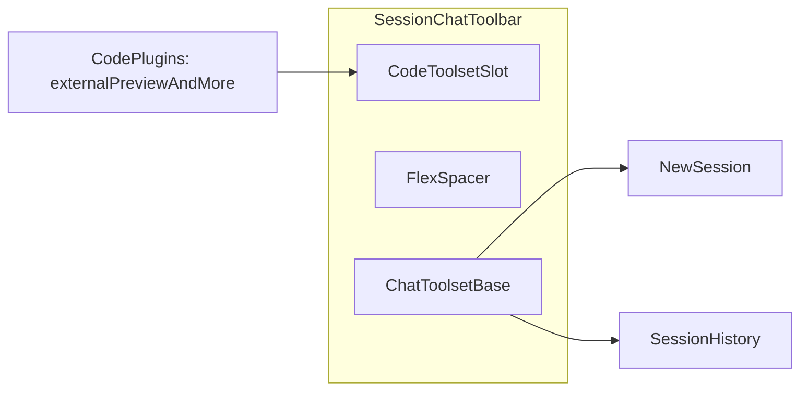

# 会话界面 v7

**状态**：v7 需求说明（Chat 工具栏业务拆分 + Code 动态插槽）  
**关联**：[会话界面 v6](./v6.md)（Chat 工具栏 + 历史抽屉）；[会话界面 v5](./v5.md)；[与 gepick-app 配套对接说明](../与-gepick-app-配套对接说明.md)

---

## 1. 目的与范围

在 v6 基础上，v7 聚焦 **Chat 工具栏的进一步设计拆分**：

- 工具栏拆分为两个业务区域：
  - **左侧：Code 业务区域工具集**（动态插槽容器，可扩展插件）；
  - **右侧：Chat 业务区域工具集**（当前固定为「新建会话」「会话历史」）。
- 首个 Code 插件示例为 **外部预览**：在浏览器新开标签页打开当前会话对应的网页预览入口，便于全屏查看 agent 产出页面。

v7 **不改变**：会话 API、`currentSessionId` / `messagesBySession`、SSE 合并、删除会话协议、历史抽屉协议。  
v7 仅新增并明确 **工具栏内部的业务分区与扩展机制**。

---

## 2. 工具栏分区定义（v7 定稿）

### 2.1 区域语义（LTR）

| 区域 | 位置 | 职责 |
|------|------|------|
| **Code 业务区域工具集** | 左侧 | 承载代码工作区/预览相关动作；以插槽容器方式渲染外部插件组件 |
| **Chat 业务区域工具集** | 右侧 | 承载 AI 会话生命周期动作；当前为「新建会话」「会话历史」 |

### 2.2 布局建议

- 工具栏单行 `flex` + `items-center`；
- 左侧 Code 区：`flex shrink-0 items-center gap-2`；
- 中间：`flex-1 min-w-0` 占位（用于拉开左右区域，避免按钮组互相挤压）；
- 右侧 Chat 区：`flex shrink-0 items-center gap-2`；
- 左侧无插件时允许为空，不渲染占位按钮。

---

## 3. Code 动态插槽（插件容器）约束

### 3.1 职责边界

- 插槽容器只负责：
  - 收集插件；
  - 顺序渲染插件；
  - 提供统一间距/分组语义。
- 插件组件自行负责：
  - 业务状态判断（可用/禁用）；
  - 点击行为；
  - 文案、图标、提示。

### 3.2 依赖方向

- `session/` 仅定义和使用插槽契约，**不引入** `@/code/*`；
- `code/` 侧通过组合层注入插件（Provider 注册或 props 注入）；
- 业务组合发生在 `App` 或等价集成层，不让 `session` 反向依赖具体业务块。

### 3.3 扩展机制（实现可选）

- **方案 A：Context + 注册表**  
  适合多插件演进，支持 `id` 与可选 `priority` 排序。
- **方案 B：Props 注入 `ReactNode`**  
  适合当前快速落地（插件数量少）；后续可平滑升级到方案 A。

---

## 4. 首个插件：外部预览

### 4.1 功能描述

- 在 Code 业务区域工具集中提供「外部预览」按钮；
- 点击后在浏览器新标签页打开当前会话对应的预览 URL；
- 用于查看 agent 生成网页的完整窗口效果（与内嵌预览互补）。

### 4.2 交互与安全约束

- 无有效预览 URL 时按钮禁用；
- 打开方式建议使用新标签并带安全参数（如 `noopener` / `noreferrer`）。

---

## 5. 目录建议（v7 增量）

在 `session/` 与 `code/` 各自业务块内演进，不引入技术横切顶层目录：

```text
packages/client/src/session/
  chat/
    session-chat-toolbar.tsx                # 调整为左 code 区 + 右 chat 区
    chat-toolbar-code-slot-context.tsx      # 可选：若采用 Context 注册表

packages/client/src/code/
  code-chat-toolbar-plugins.tsx             # code 工具集聚合（外部预览等）
  external-preview-toolbar-button.tsx       # 可选：单插件拆分
```

约束：

- 文件名保持 `kebab-case`；
- 插槽在 session 域定义，插件在 code 域定义；
- 组合逻辑放 `app.tsx` 或等价 integration 文件。

---

## 6. 关系示意（实现导向）



---

## 7. 验收标准

- 文档明确 v7 目标：Chat 工具栏拆分为 **Code 工具集（左）+ Chat 工具集（右）**；
- 文档明确 Code 区为**动态插槽容器**，支持外部插件扩展；
- 文档明确 Chat 区现有能力保留：**新建会话 + 会话历史**；
- 文档明确首个插件为 **外部预览**，并可新标签页打开预览页面；
- 文档明确 `session` 不依赖 `code` 具体实现，仅暴露插槽契约。

---

## 8. 修订记录

| 日期 | 说明 |
|------|------|
| 2026-04-28 | 新增 v7：Chat 工具栏业务拆分（左 code 动态插槽 + 右 chat 工具集），定义首个外部预览插件。 |
