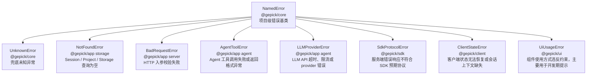

# NamedError 设计说明（v1）

## 1. 项目级业务场景

`@gepick/core` 面向整个 gepick monorepo 提供跨包共享的基础能力。错误结构属于这种能力：它不只服务 `@gepick/app` 的 HTTP 响应，也会影响 `@gepick/sdk` 的协议建模、`@gepick/client` 的错误识别，以及未来队列、持久化、Agent 工具调用等跨边界场景。

在项目里，不同包会遇到不同来源的异常：

- `@gepick/app`：Session、Storage、Agent、LLM provider、数据库等服务端业务异常。
- `@gepick/sdk`：把服务端错误协议转成客户端可消费的类型。
- `@gepick/client`：根据错误 `name` 展示不同的 UI 反馈或恢复动作。
- 未来异步任务或消息通道：需要把错误序列化后跨进程、跨队列传递。

如果每个包都自己定义错误格式，最终会出现几个问题：服务端不好统一映射 HTTP status，SDK 不好生成稳定类型，客户端只能解析不稳定的字符串，日志和持久化也难以复用同一份结构。项目级需要一个统一的错误协议：既能保留业务语义，又能跨包、跨边界传递。

`NamedError` 就是放在 `@gepick/core` 里的错误基础结构。它解决的问题不是“某一个业务错误怎么写”，而是“所有包如何用同一种方式创建、识别、序列化和校验业务错误”。

## 2. 设计目标

`NamedError` 的设计目标是让每个业务错误都具备稳定形态：

- 可识别：运行时可以用 `instanceof` 判断具体错误类，也可以用序列化后的 `name` 判断错误场景。
- 可序列化：错误实例可以转成 `{ name, data }`，用于 HTTP response、SDK、日志、队列或存储。
- 可校验：外部传回来的 unknown JSON 可以通过 Zod schema 校验，避免把不可信对象当成业务错误。
- 可追踪：业务错误可以通过 `ErrorOptions.cause` 保留底层原始异常，便于日志、调试和链路追踪。
- 可扩展：各业务包只需要调用 `NamedError.create` 创建自己的错误类，不需要修改 `@gepick/core`。
- 可共享：基础结构从 `@gepick/core` 导出，所有包只从 `@gepick/core` 入口引用。

## 3. API 设计

`NamedError` 是抽象基类，不直接表达某个具体业务错误。具体错误由 `NamedError.create(name, data)` 创建。

`name` 是稳定错误名，用于运行时识别和序列化输出。`data` 是 Zod schema，用于描述该错误携带的结构化业务数据。

```ts
import { NamedError } from "@gepick/core"
import z from "zod"

export const NotFoundError = NamedError.create(
  "NotFoundError",
  z.object({
    message: z.string(),
  }),
)
```

这个 API 会生成一个具体错误类，并引出以下结果：

| API | 所属阶段 | 作用 | 结果 |
| --- | --- | --- | --- |
| `new NotFoundError(data)` | 创建 | 创建具体业务错误实例 | 得到可 `throw` 的错误对象 |
| `err instanceof NamedError` | 运行时处理 | 识别是否是项目标准错误 | 进入统一错误处理分支 |
| `err instanceof NotFoundError` | 运行时处理 | 识别具体业务场景 | 映射 404、400、500 等响应策略 |
| `NotFoundError.is(err)` | 运行时处理 | 根据稳定 `name` 判断 unknown 错误是否属于具体错误类型 | 得到具体错误类型的类型收窄 |
| `NotFoundError.Schema` | 反序列化 / 文档 | 获取该错误的 `{ name, data }` schema | 校验 unknown JSON，或接入 OpenAPI / SDK |
| `error.schema()` | 反序列化 / 组合 | 从实例拿到同一份 schema | 动态组合或校验当前错误对象 |
| `error.toObject()` | 序列化 | 转成稳定 JSON shape | 得到 `{ name, data }` |

`toObject()` 是序列化路径：代码已经有可信错误实例，需要把它发给 HTTP 客户端、SDK、日志、队列或其他系统。

`Schema` / `schema()` 是反序列化路径：代码拿到的是外部输入，例如网络、storage、队列、其他进程传回来的 unknown JSON，需要先校验再信任。

## 4. 工程使用方式

`@gepick/core` 只提供基础结构和通用兜底错误，例如 `UnknownError`。具体业务错误仍然定义在各自业务归属包或模块里。

服务端 storage 模块可以定义资源不存在错误：

```ts
import { NamedError } from "@gepick/core"
import z from "zod"

export const NotFoundError = NamedError.create(
  "NotFoundError",
  z.object({
    message: z.string(),
  }),
)
```

业务代码在异常路径抛出具体错误：

```ts
if (!row) {
  throw new NotFoundError({ message: `Session not found: ${sessionId}` })
}
```

HTTP 入口统一捕获项目标准错误，并按具体类型映射响应：

```ts
import { NamedError, UnknownError } from "@gepick/core"

if (err instanceof NamedError) {
  if (err instanceof NotFoundError) {
    return c.json(err.toObject(), 404)
  }

  return c.json(err.toObject(), 500)
}

return c.json(new UnknownError({ message }).toObject(), 500)
```

如果捕获到的是 `unknown`，或者错误对象可能来自不同包、不同运行时边界，具体错误类也提供 `is()` 作为轻量类型守卫。它不依赖 `instanceof` 的原型链，而是按该错误类稳定的 `name` 判断当前值是否属于这个错误类型：

```ts
try {
  await loadSession(sessionId)
} catch (err) {
  if (NotFoundError.is(err)) {
    return c.json(err.toObject(), 404)
  }

  if (UnknownError.is(err)) {
    return c.json(err.toObject(), 500)
  }

  return c.json(new UnknownError({ message: "Unexpected error" }).toObject(), 500)
}
```

SDK 或客户端面对错误响应时，可以把 `name` 当作稳定判别字段：

```ts
const error = await response.json()

if (error.name === "NotFoundError") {
  // 展示资源不存在提示，或触发客户端恢复流程
}
```

当错误对象需要跨边界输出时，用 `toObject()` 得到稳定结构：

```ts
const error = new NotFoundError({ message: "Session not found" })

error.toObject()
// { name: "NotFoundError", data: { message: "Session not found" } }
```

当错误对象来自外部边界时，用 `Schema` 或 `schema()` 校验：

```ts
const input = JSON.parse(rawMessage)

const parsed = NotFoundError.Schema.parse(input)
// { name: "NotFoundError", data: { message: "Session not found" } }
```

## 5. 保留底层 cause

`NamedError.create` 生成的错误类构造函数接收两个参数：

```ts
new SomeError(data, options?)
```

第一个参数 `data` 是业务可见的结构化错误数据，会进入 `toObject()` 的 `{ name, data }` 输出。第二个参数 `options` 是标准 `ErrorOptions`，常见用法是传入 `{ cause }`，用于保留底层原始异常。

典型场景是：业务层需要把底层错误包装成稳定的业务错误，但又不想把原始异常直接暴露给 HTTP response、SDK、客户端或持久化协议。

例如读取配置文件中的 `{file:...}` 引用失败时，对外只需要告诉用户“哪个配置源无效、业务提示是什么”，但内部调试仍然需要知道底层是 `ENOENT`、权限错误、文件系统错误还是其他异常：

```ts
export const ConfigInvalidError = NamedError.create(
  "ConfigInvalidError",
  z.object({
    path: z.string(),
    message: z.string().optional(),
  }),
)

try {
  await readConfigReference(filepath)
} catch (error) {
  throw new ConfigInvalidError(
    {
      path: configSource,
      message: `bad file reference: "{file:${filepath}}"`,
    },
    { cause: error },
  )
}
```

这里的分工是：

- `data`：稳定业务协议，适合展示给用户、返回给 SDK、写入队列或持久化。
- `cause`：内部诊断信息，保留原始错误链，适合日志、调试、错误上报和排查。

`toObject()` 只输出 `{ name, data }`，不会输出 `cause`：

```ts
const error = new ConfigInvalidError(
  { path: "config.json", message: "bad file reference" },
  { cause: fsError },
)

error.toObject()
// { name: "ConfigInvalidError", data: { path: "config.json", message: "bad file reference" } }
```

这样设计的原因是：`cause` 可能包含不可序列化对象、系统路径、堆栈、底层响应体或敏感信息，不应该成为跨边界错误协议的一部分。业务边界只消费稳定的 `{ name, data }`；服务端内部仍然可以通过 `error.cause` 追踪真实原因。

## 6. 包边界约定

`@gepick/core` 是基础设施包，只导出根入口 `@gepick/core`。业务包不应该从 `@gepick/core/error` 这类子路径导入，避免把内部文件结构变成公共 API。

推荐：

```ts
import { NamedError, UnknownError } from "@gepick/core"
```

不推荐：

```ts
import { NamedError } from "@gepick/core/error"
```

具体错误类型按业务归属放置。例如 storage 相关错误放在 `@gepick/app` 的 storage 模块，Agent 相关错误放在 Agent 模块。`@gepick/core` 不维护所有业务错误枚举，只维护创建规则和通用基础类型。

## 7. 项目收益

把 `NamedError` 放到 `@gepick/core` 后，项目获得的是一套跨包一致的错误协议：

- `@gepick/app` 可以统一捕获和序列化业务错误。
- `@gepick/sdk` 可以围绕 `{ name, data }` 建模错误响应。
- `@gepick/client` 可以基于 `name` 做稳定 UI 分支，而不是解析字符串。
- 新业务模块可以局部扩展自己的错误类型，不需要修改全局枚举。
- 错误结构天然适合日志、OpenAPI、队列、持久化等跨边界场景。
- 底层异常可以通过 `cause` 保留在服务端内部，避免把调试细节泄露到公共错误协议。

最终收益是让“错误”从临时异常字符串变成项目级协议：业务语义稳定、跨包传递一致、类型和运行时校验都能保留下来。

## 8. 场景树

下面的图展示 `NamedError` 作为项目级根结构，如何派生出不同包、不同业务场景需要的错误类型。其中 `UnknownError` 和 `NotFoundError` 是当前已有类型，其余是后续可扩展的例子。



这棵树表达的是职责边界：`NamedError` 定义统一协议，具体错误类型服务各自业务场景。每个包可以围绕自己的业务需要创建错误，但最终都回到同一个 `{ name, data }` 结构，方便项目整体消费。
