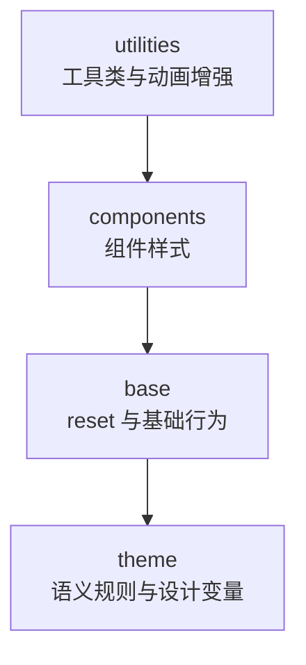

# @gepick/ui styles 说明（v2）

## 目标

`ui/src/styles` 的设计，本质上解决的是“样式规则分散、颜色来源失控、跨技术栈不一致”这三个问题。  
它把用色和样式规则收敛成统一入口：先定义调色板，再定义用途规则，组件最终只按语义变量取值。

- 可能碰到的具体场景与对应收益
  - 新增页面或新组件时，最容易出现“每个人按自己习惯写色值”。这套设计让大家直接复用现有语义变量，样式一致性更稳。
  - 设计稿调整主色、状态色（如 warning/critical）时，最怕全局到处改。现在只要改调色板和用途映射，上层组件不需要逐个改代码。
  - 亮暗模式和交互状态（hover/active/disabled）常常会漏改。语义规则提前把这些状态收进体系，能减少遗漏和冲突。
  - 项目同时使用手写 CSS 和 Tailwind 时，容易出现两套颜色标准。通过 `styles/tailwind` 桥接后，两条通道使用同一套语义规则，视觉不会跑偏。

---

## 方案设计

### `@layer` 分层骨架

`@layer` 是 CSS 的分层语法。它的作用是先定义样式分层，再明确每一层的覆盖优先级，避免样式冲突时只能靠选择器权重和 import 顺序“猜结果”。

下面是一个使用 `@layer` 的例子：

```css
@layer theme, base, components, utilities;
```

上面我们使用 `@layer` 定义了 4 个层级：`theme`、`base`、`components`、`utilities`。在 `@layer` 语法中，越靠后定义的层优先级越高，因此这里的优先级关系是：`utilities > components > base > theme`。




如果不使用 `@layer`，优先级会更多依赖 import 先后和选择器权重，容易出现样式互相打架、改一处影响多处、不断加权重甚至 `!important`。  
使用 `@layer` 后，优先级规则是显式的，覆盖关系更可预测，维护成本更低。
记忆法：声明里越靠后，优先级越高（图中越靠上）。

### 建立样式体系

既然我们用 `@layer` 建立样式层级，手写样式体系就按四层来设计：

- 设计 `theme` 层，负责规则源头
  - `colors.css` 提供调色板（颜色原料）
  - `theme.css` 提供用途规则（语义变量）
- 设计 `base` 层，负责 reset 和基础行为
- 设计 `components` 层，负责组件样式
- 设计 `utilities` 层，负责工具类和动画能力

最后通过 `index.css` 统一聚合这四层，并作为手写样式入口导出。

### 桥接 Tailwind 样式体系

实际上，到手写样式体系这一步已经足够支撑大多数开发：  
你可以在需要的地方直接使用语义变量来写样式，不需要先引入 Tailwind。

例如：

```css
.btn {
  color: var(--text-base);
  border-color: var(--border-base);
  background: var(--surface-base);
}
```

不过，我们的项目引入了 Tailwind CSS。它是一套原子类样式方案，主要解决的是“页面开发时快速组合样式、减少重复手写 CSS、提升迭代效率”的问题。  
为了给调用方多一种选择（除了手写 CSS，还可以用 Tailwind 类名），并且继续复用我们已经建立的样式体系，我们需要把两种体系做桥接。

桥接后，调用方可以通过 Tailwind 的写法继续开发界面，同时仍然使用同一套语义规则和颜色来源，不会和手写样式体系割裂。

例如，现在你可以直接用 Tailwind 的方式来消费我们建立的样式体系，只需要先在全局入口引入：

```css
@import "@gepick/ui/styles/tailwind";
```

然后在组件里正常写 Tailwind 类名：

```tsx
export function SaveButton() {
  return (
    <button className="bg-surface-base text-text-base border border-border-base hover:bg-surface-base-hover">
      保存
    </button>
  )
}
```

底层实现上，我们不是再造一套规则，而是做桥接：

- 在 `styles/tailwind/index.css` 用 `@theme` 桥接非颜色 token
- 通过 `scripts/tailwind.ts` 生成 `styles/tailwind/colors.css`，桥接颜色 token
- 最终保持双通道一致
  - 手写 CSS 用 `var(--语义变量)`
  - Tailwind 用 `--color-*` 映射后的 token

---

## 工程落地

### 建立样式体系

- 第一步：建立四层入口与聚合关系
  - 在 `styles/index.css` 声明：`@layer theme, base, components, utilities;`
  - 保证 `index.css` 聚合 `theme/base/components/utilities` 四层内容
- 第二步：落地 `theme` 层规则源头
  - `styles/colors.css`：维护基础调色板（颜色原料）
  - `styles/theme.css`：维护用途规则（语义变量）
- 第三步：落地基础与增强层
  - `styles/base.css`：reset 和基础行为
  - `styles/utilities.css`、`styles/animations.css`：工具类与动画
- 第四步：组件消费规则
  - 组件样式优先使用语义变量（如 `var(--text-base)`），不直接写裸色值

规则命名建议：

- 用途域（前缀）：`text-*`、`surface-*` / `background-*`、`border-*`、`icon-*`、`input-*`、`syntax-*`、`markdown-*`、`button-*`
- 状态（后缀）：`base`、`hover`、`active`、`selected`、`focus`、`disabled`
- 层级（强度）：`weaker`、`weak`、`base`、`strong`、`stronger`
- 快速判断：先选用途域，再选状态，最后选强度

### 桥接 Tailwind 体系

手写体系负责定义规则，Tailwind 体系负责消费同一套规则。

- 第一步：提供 Tailwind 桥接入口
  - `styles/tailwind/index.css`：作为 Tailwind 总入口，负责分层声明与总装配，包含：
    - `@layer theme, base, components, utilities;`
    - `@import "tailwindcss/theme.css" layer(theme);`
    - `@import "tailwindcss/utilities.css" layer(utilities) source("../../../../");`
    - `@import "./utilities.css";`
    - `@import "../index.css";`
  - `styles/tailwind/utilities.css`：提供 `@utility` 扩展能力
- 第二步：生成颜色映射
  - 输入：`scripts/colors.txt`（映射白名单）
  - 脚本：`scripts/tailwind.ts`
  - 输出：`styles/tailwind/colors.css`（`--color-*` 映射，生成文件不手改）
- 第三步：业务侧接入
  - 在全局入口只引一次：

```css
@import "@gepick/ui/styles/tailwind";
```

- 第四步：按需迁移
  - 先把静态样式跑通（`styles/tailwind`）
  - 再按需接入 `src/theme` 的运行时主题能力

